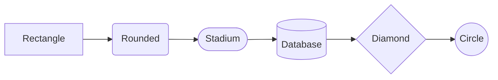

# Mermaid Syntax Skill

A Claude Code skill for generating error-free Mermaid diagrams. Prevents common syntax errors with special characters, reserved words, and escaping rules.

## Installation

```bash
# Clone to your Claude Code skills directory
git clone https://github.com/awesome-skills/mermaid-syntax-skill.git ~/.claude/skills/mermaid-syntax
```

## Features

- **Critical Error Prevention** - Handles 90% of common Mermaid syntax errors
- **Complete Syntax Reference** - Flowchart, Sequence, Class, and State diagrams
- **Working Examples** - Ready-to-use diagram patterns

## Common Errors This Skill Prevents

| Error Type | Problem | Solution |
|------------|---------|----------|
| Special Characters | `A[Text (with) parens]` breaks | Use quotes: `A["Text (with) parens"]` |
| Reserved Word "end" | `A --> end` breaks diagram | Use `A --> End` or `A --> ["end"]` |
| Node ID with o/x | `oNode` creates circle edge | Use descriptive names: `orderNode` |
| Semicolon in Sequence | `A->>B: key;value` breaks | Use entity: `A->>B: key#59;value` |

## Skill Structure

```
mermaid-syntax/
├── SKILL.md              # Core syntax rules (auto-loaded when triggered)
├── references/
│   ├── flowchart-complete.md    # All node shapes, edges, subgraphs
│   ├── sequence-complete.md     # Messages, activations, control flow
│   └── class-state-complete.md  # Class/State diagram syntax
└── examples/
    ├── flowchart-examples.md    # 8 flowchart patterns
    └── sequence-examples.md     # 10 sequence diagram patterns
```

## Trigger Keywords

The skill activates when you mention:
- `mermaid`, `diagram`, `flowchart`
- `sequence diagram`, `class diagram`, `state diagram`

## Quick Reference

### Flowchart Node Shapes



### Sequence Diagram Arrows

| Syntax | Description |
|--------|-------------|
| `->>` | Solid arrow |
| `-->>` | Dotted arrow |
| `-x` | Cross end |
| `-)` | Async (open arrow) |

### Class Diagram Relationships

| Syntax | Meaning |
|--------|---------|
| `<\|--` | Inheritance |
| `*--` | Composition |
| `o--` | Aggregation |
| `-->` | Association |

## License

MIT
