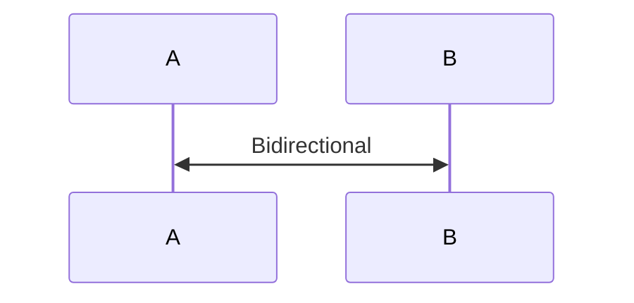

# Mermaid Syntax Skill

A Claude Code skill for generating error-free Mermaid diagrams. Prevents common syntax errors with special characters, reserved words, and escaping rules. **Supports Mermaid v11 features.**

## Installation

```bash
# Clone to your Claude Code skills directory
git clone https://github.com/awesome-skills/mermaid-syntax-skill.git ~/.claude/skills/mermaid-syntax
```

## Features

- **Critical Error Prevention** - Handles 90% of common Mermaid syntax errors
- **Mermaid v11 Support** - Hand-drawn look, bidirectional arrows, new diagram types
- **Complete Syntax Reference** - Flowchart, Sequence, Class, State, ER, Gantt, Git Graph, and more
- **Working Examples** - Ready-to-use diagram patterns
- **Validation Script** - Check diagrams for common errors before committing

## Common Errors This Skill Prevents

| Error Type | Problem | Solution |
|------------|---------|----------|
| Special Characters | `A[Text (with) parens]` breaks | Use quotes: `A["Text (with) parens"]` |
| Reserved Word "end" | `A --> end` breaks diagram | Use `A --> End` or `A --> ["end"]` |
| Node ID with o/x | `oNode` creates circle edge | Use descriptive names: `orderNode` |
| Semicolon in Sequence | `A->>B: key;value` breaks | Use entity: `A->>B: key#59;value` |
| Single % comment | `% comment` breaks | Use `%% comment` |
| Subgraph with `<br/>` | `subgraph Title<br/>` breaks | Use `subgraph "Title<br/>"` |
| stroke-dasharray comma | `stroke-dasharray: 5,5` breaks | Escape: `stroke-dasharray: 5\,5` |

## Skill Structure

```
mermaid-syntax/
├── SKILL.md              # Core syntax rules (auto-loaded when triggered)
├── references/
│   ├── flowchart-complete.md    # All 30+ node shapes, edges, subgraphs
│   ├── sequence-complete.md     # Messages, activations, control flow
│   ├── class-state-complete.md  # Class/State/ER diagram syntax
│   └── other-diagrams.md        # Gantt, Pie, Git Graph, Mindmap, Timeline
├── examples/
│   ├── flowchart-examples.md    # 8 flowchart patterns
│   └── sequence-examples.md     # 10 sequence diagram patterns
└── scripts/
    └── validate-mermaid.sh      # Syntax validation helper
```

## Trigger Keywords

The skill activates when you mention:
- `mermaid`, `diagram`, `flowchart`
- `sequence diagram`, `class diagram`, `state diagram`
- `fix mermaid error`, `diagram not rendering`
- `ER diagram`, `gantt chart`

## Mermaid v11 Features

### Hand-Drawn Look


### Bidirectional Arrows



### New Diagram Types
- Packet Diagram
- XY Chart
- Block Diagram
- Sankey Diagram
- Architecture Diagram

## Quick Reference

### Flowchart Node Shapes


### Sequence Diagram Arrows

| Syntax | Description |
|--------|-------------|
| `->>` | Solid arrow |
| `-->>` | Dotted arrow |
| `-x` | Cross end |
| `-)` | Async (open arrow) |
| `<<->>` | Bidirectional (v11) |

### Class Diagram Relationships

| Syntax | Meaning |
|--------|---------|
| `<\|--` | Inheritance |
| `*--` | Composition |
| `o--` | Aggregation |
| `-->` | Association |

## Validation

Use the included validation script:

```bash
# Validate a file
./scripts/validate-mermaid.sh diagram.md

# Or pipe content
echo "flowchart LR\n  A-->B" | ./scripts/validate-mermaid.sh
```

Or test at: https://mermaid.live/

## Resources

- [Mermaid Live Editor](https://mermaid.live/)
- [Official Documentation](https://mermaid.js.org/intro/syntax-reference.html)
- [GitHub Repository](https://github.com/mermaid-js/mermaid)

## License

MIT
