# Mermaid Diagram Syntax Guide

Comprehensive syntax reference for generating error-free Mermaid diagrams. This skill prevents common mistakes when creating flowcharts, sequence diagrams, class diagrams, and state diagrams.

## Critical Rules (Prevent 90% of Errors)

### 1. Special Character Escaping

**Always wrap text containing special characters in double quotes:**

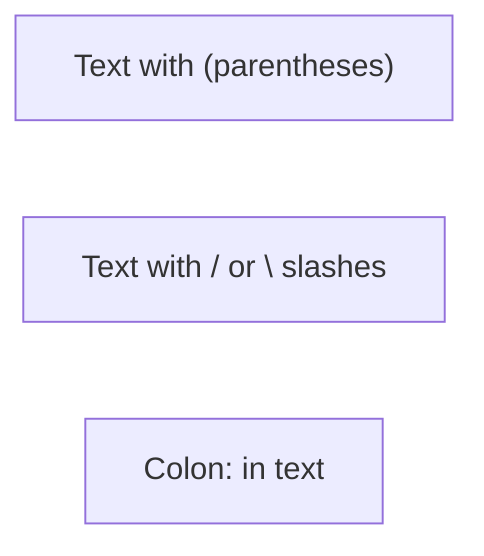

**Characters requiring quotes:** `( ) [ ] { } / \ : ; # @ ! ? < > " '`

### 2. Reserved Word "end"

The word "end" breaks diagrams. Solutions:

```mermaid
flowchart LR
    A["Start"] --> B["End"]         %% Quoted
    C[Start] --> D{{End}}           %% Wrapped in shape brackets
    E[Start] --> F(End)             %% Wrapped in parentheses
```

**Never use:** `A[end]` or `A --> end`

### 3. Node ID Starting Characters

Nodes starting with `o` or `x` create unintended edge types:

```mermaid
flowchart LR
    orderNode[Order]    %% Good: full word
    oNode[O-Node]       %% Bad: might create circle edge
```

**Solution:** Use descriptive IDs, avoid single letters `o` or `x` at start.

### 4. HTML Entity Codes for Semicolons

In sequence diagrams, semicolons define line breaks. Use `#59;` for literal semicolons:

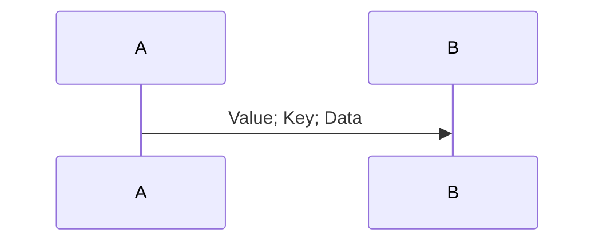

## Diagram Type Quick Reference

### Flowchart Direction

| Syntax | Direction |
|--------|-----------|
| `flowchart TB` | Top to Bottom |
| `flowchart TD` | Top Down (same as TB) |
| `flowchart BT` | Bottom to Top |
| `flowchart LR` | Left to Right |
| `flowchart RL` | Right to Left |

### Node Shapes

| Syntax | Shape |
|--------|-------|
| `A[text]` | Rectangle |
| `A(text)` | Rounded rectangle |
| `A([text])` | Stadium |
| `A[[text]]` | Subroutine |
| `A[(text)]` | Cylinder (database) |
| `A((text))` | Circle |
| `A{text}` | Diamond |
| `A{{text}}` | Hexagon |
| `A>text]` | Asymmetric |

### Edge Types

| Syntax | Type |
|--------|------|
| `A --> B` | Arrow |
| `A --- B` | Line (no arrow) |
| `A -.- B` | Dotted line |
| `A ==> B` | Thick arrow |
| `A -.-> B` | Dotted arrow |
| `A --text--> B` | Arrow with text |
| `A -- text --- B` | Line with text |

### Subgraph Syntax

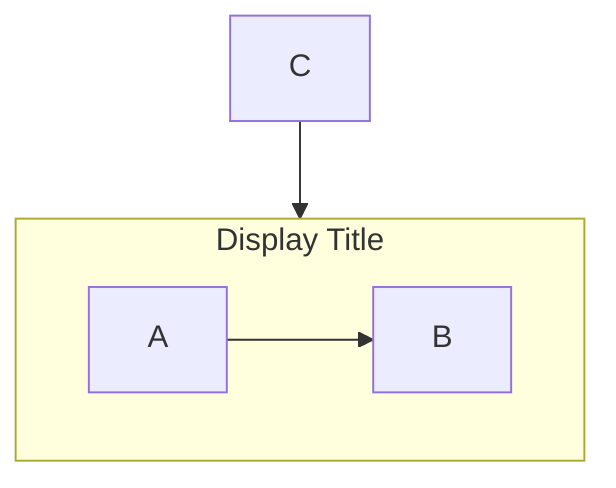

## Sequence Diagram Essentials

### Message Arrow Types

| Syntax | Description |
|--------|-------------|
| `A->B` | Solid line, no arrow |
| `A-->B` | Dotted line, no arrow |
| `A->>B` | Solid line, arrowhead |
| `A-->>B` | Dotted line, arrowhead |
| `A-xB` | Solid line, cross end |
| `A-)B` | Solid line, open arrow (async) |

### Participant Definition

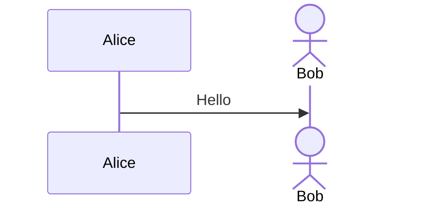

### Activation

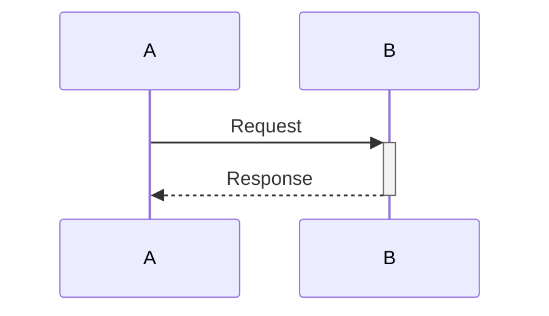

Or explicit:

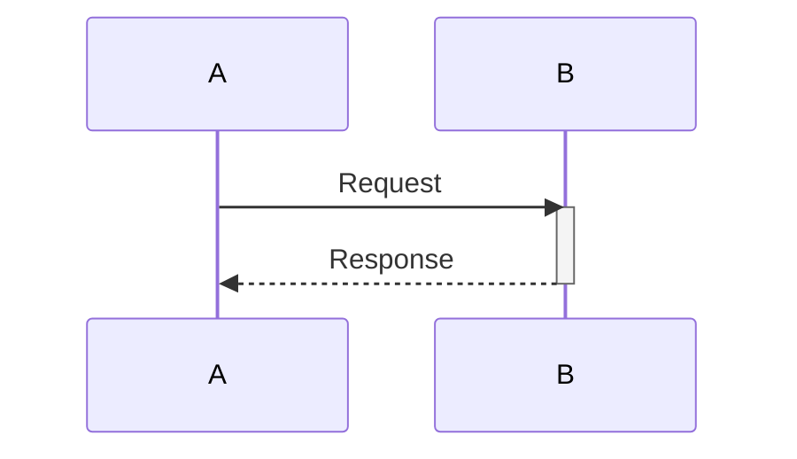

### Control Flow

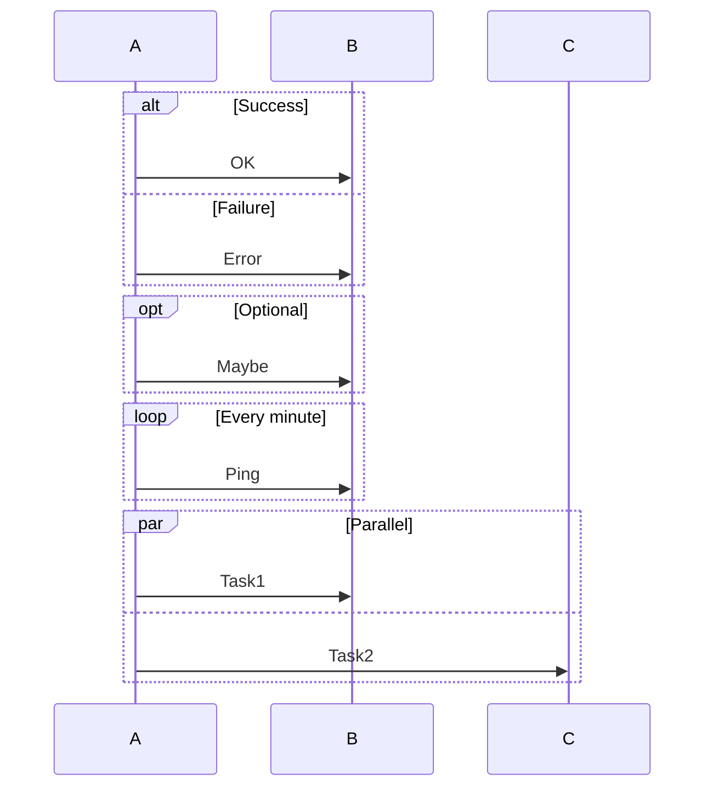

### Notes

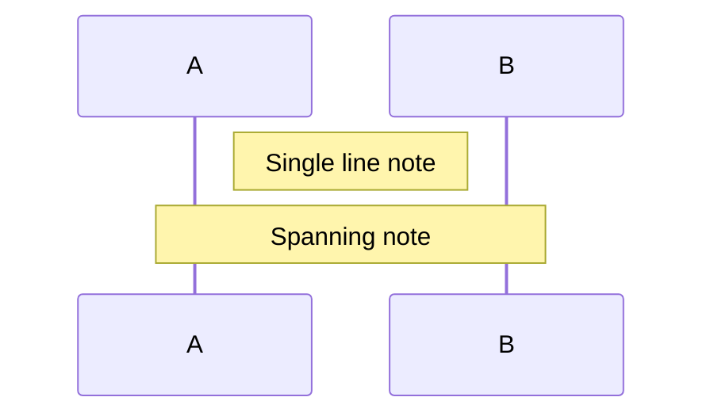

## Class Diagram Essentials

### Class Definition

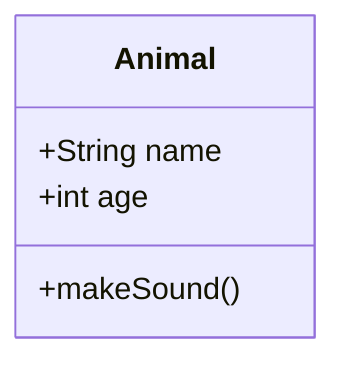

### Visibility Modifiers

| Symbol | Meaning |
|--------|---------|
| `+` | Public |
| `-` | Private |
| `#` | Protected |
| `~` | Package/Internal |

### Relationships

| Syntax | Meaning |
|--------|---------|
| `A <\|-- B` | Inheritance (B extends A) |
| `A *-- B` | Composition |
| `A o-- B` | Aggregation |
| `A --> B` | Association |
| `A ..> B` | Dependency |
| `A ..\|> B` | Realization |

### Cardinality

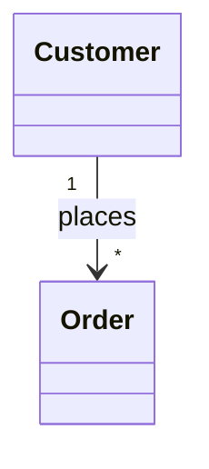

## State Diagram Essentials

### Basic States

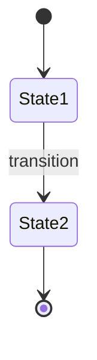

### Composite States

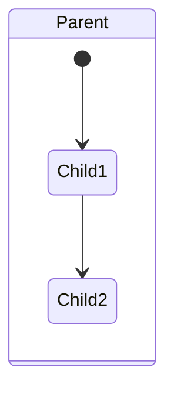

### Choice and Fork

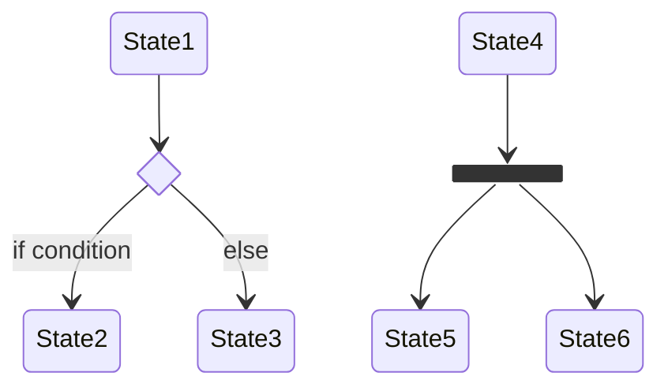

## Common Error Patterns

### Error 1: Unquoted Special Characters

```
%% BAD - breaks parsing
A[Click here (optional)]
B[User: Admin]

%% GOOD - quoted text
A["Click here (optional)"]
B["User: Admin"]
```

### Error 2: Reserved Word "end"

```
%% BAD - breaks diagram
A --> end
subgraph end

%% GOOD - quoted or capitalized
A --> End
A --> ["end"]
subgraph "End Phase"
```

### Error 3: Semicolon in Sequence Diagram

```
%% BAD - treated as line break
A->>B: key;value;data

%% GOOD - HTML entity
A->>B: key#59;value#59;data
```

### Error 4: Nested Quotes

```
%% BAD - quote conflict
A["Say "Hello""]

%% GOOD - use single quotes inside
A["Say 'Hello'"]
%% Or use HTML entity
A["Say #quot;Hello#quot;"]
```

### Error 5: Colon Without Quotes in Flowchart

```
%% BAD - colon breaks node text
A[Step 1: Initialize]

%% GOOD - quoted
A["Step 1: Initialize"]
```

## Validation Checklist

Before finalizing any Mermaid diagram:

1. [ ] All text with special characters is quoted
2. [ ] No bare "end" word (quoted or wrapped)
3. [ ] No node IDs starting with single `o` or `x`
4. [ ] Semicolons in sequence messages use `#59;`
5. [ ] Nested quotes use single quotes or HTML entities
6. [ ] Subgraph titles are quoted if containing special chars
7. [ ] Diagram type declaration is correct (`flowchart`, not `flow-chart`)

## Additional Resources

### Reference Files

For detailed syntax of each diagram type:
- **`references/flowchart-complete.md`** - All 30+ node shapes, edge styling, subgraph nesting
- **`references/sequence-complete.md`** - All message types, boxes, breaks, critical sections
- **`references/class-state-complete.md`** - Class annotations, state concurrency, notes

### Example Files

Working examples in `examples/`:
- **`examples/flowchart-examples.md`** - Common flowchart patterns
- **`examples/sequence-examples.md`** - API flow, auth flow patterns
