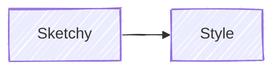

# Mermaid Diagram Syntax Guide

Comprehensive syntax reference for generating error-free Mermaid diagrams. Prevents common mistakes and supports Mermaid v11 features including flowcharts, sequence diagrams, class diagrams, state diagrams, ER diagrams, Gantt charts, and more.

**Test diagrams at:** https://mermaid.live/

## Critical Rules (Prevent 90% of Errors)

### 1. Special Character Escaping

**Always wrap text containing special characters in double quotes:**


**Characters requiring quotes:** `( ) [ ] { } / \ : ; # @ ! ? < > " '`

### 2. Reserved Words (Not Just "end"!)

Multiple reserved words break diagrams. Use quoted labels with safe IDs:

```mermaid
flowchart LR
    node1["end"]           %% Safe: quoted with different ID
    node2["default"]       %% Safe: "default" is also reserved
    node3["End"]           %% Safe: capitalized
```

**All reserved words (use quoted labels):**
- `end`, `default`
- `style`, `linkStyle`, `classDef`, `class`
- `call`, `href`, `click`, `interpolate`

**Pattern:** `safeId["reserved word text"]` instead of `reserved[text]`

### 3. Node ID Starting Characters

Nodes starting with `o` or `x` create unintended edge types:

```mermaid
flowchart LR
    orderNode[Order]    %% Good: full word
    oNode[O-Node]       %% Bad: might create circle edge
```

**Solution:** Use descriptive IDs, avoid single letters `o` or `x` at start.

### 4. HTML Entity Codes for Semicolons

In sequence diagrams, semicolons define line breaks. Use `#59;` for literal semicolons:


### 5. Comments Must Use %%

Single `%` breaks diagrams. Always use `%%`:


### 6. Subgraph with HTML Tags

Wrap subgraph titles containing `<br/>` in quotes:


### 7. Style Property Escaping

Escape commas in `stroke-dasharray` with backslash:


### 8. Frontmatter Must Be First Line

The `---` for frontmatter MUST be the only content on line 1:


**Wrong:** Any whitespace or content before `---` breaks the diagram.

### 9. Mindmap `<` Character Bug

In mindmaps, `<` renders as `&lt;`. Use words instead:


### 10. Class Diagram Colon Limitations

Colons in class member types are tricky. Use return type syntax:


**Note:** Complex generic types with colons may not render correctly.

## Mermaid v11 New Features

### Hand-Drawn Look



### Bidirectional Arrows (Sequence)


### Configuration Directive


## Diagram Type Quick Reference

### Flowchart Direction

| Syntax | Direction |
|--------|-----------|
| `flowchart TB` | Top to Bottom |
| `flowchart TD` | Top Down (same as TB) |
| `flowchart BT` | Bottom to Top |
| `flowchart LR` | Left to Right |
| `flowchart RL` | Right to Left |

### Node Shapes

| Syntax | Shape |
|--------|-------|
| `A[text]` | Rectangle |
| `A(text)` | Rounded rectangle |
| `A([text])` | Stadium |
| `A[[text]]` | Subroutine |
| `A[(text)]` | Cylinder (database) |
| `A((text))` | Circle |
| `A{text}` | Diamond |
| `A{{text}}` | Hexagon |
| `A>text]` | Asymmetric |

### Edge Types

| Syntax | Type |
|--------|------|
| `A --> B` | Arrow |
| `A --- B` | Line (no arrow) |
| `A -.- B` | Dotted line |
| `A ==> B` | Thick arrow |
| `A -.-> B` | Dotted arrow |
| `A --text--> B` | Arrow with text |
| `A -- text --- B` | Line with text |

### Subgraph Syntax


## Sequence Diagram Essentials

### Message Arrow Types

| Syntax | Description |
|--------|-------------|
| `A->B` | Solid line, no arrow |
| `A-->B` | Dotted line, no arrow |
| `A->>B` | Solid line, arrowhead |
| `A-->>B` | Dotted line, arrowhead |
| `A-xB` | Solid line, cross end |
| `A-)B` | Solid line, open arrow (async) |

### Participant Definition


### Activation


Or explicit:


### Control Flow


### Notes


## Class Diagram Essentials

### Class Definition


### Visibility Modifiers

| Symbol | Meaning |
|--------|---------|
| `+` | Public |
| `-` | Private |
| `#` | Protected |
| `~` | Package/Internal |

### Relationships

| Syntax | Meaning |
|--------|---------|
| `A <\|-- B` | Inheritance (B extends A) |
| `A *-- B` | Composition |
| `A o-- B` | Aggregation |
| `A --> B` | Association |
| `A ..> B` | Dependency |
| `A ..\|> B` | Realization |

### Cardinality

```mermaid
classDiagram
    Customer "1" --> "*" Order : places
```

## State Diagram Essentials

### Basic States

```mermaid
stateDiagram-v2
    [*] --> State1
    State1 --> State2: transition
    State2 --> [*]
```

### Composite States

```mermaid
stateDiagram-v2
    state Parent {
        [*] --> Child1
        Child1 --> Child2
    }
```

### Choice and Fork

```mermaid
stateDiagram-v2
    state choice <<choice>>
    State1 --> choice
    choice --> State2: if condition
    choice --> State3: else

    state fork <<fork>>
    State4 --> fork
    fork --> State5
    fork --> State6
```

## Common Error Patterns

### Error 1: Unquoted Special Characters

```
%% BAD - breaks parsing
A[Click here (optional)]
B[User: Admin]

%% GOOD - quoted text
A["Click here (optional)"]
B["User: Admin"]
```

### Error 2: Reserved Word "end"

```
%% BAD - breaks diagram
A --> end
subgraph end

%% GOOD - quoted or capitalized
A --> End
A --> ["end"]
subgraph "End Phase"
```

### Error 3: Semicolon in Sequence Diagram

```
%% BAD - treated as line break
A->>B: key;value;data

%% GOOD - HTML entity
A->>B: key#59;value#59;data
```

### Error 4: Nested Quotes

```
%% BAD - quote conflict
A["Say "Hello""]

%% GOOD - use single quotes inside
A["Say 'Hello'"]
%% Or use HTML entity
A["Say #quot;Hello#quot;"]
```

### Error 5: Colon Without Quotes in Flowchart

```
%% BAD - colon breaks node text
A[Step 1: Initialize]

%% GOOD - quoted
A["Step 1: Initialize"]
```

## Other Diagram Types (Quick Start)

### ER Diagram

```mermaid
erDiagram
    CUSTOMER ||--o{ ORDER : places
    ORDER ||--|{ LINE-ITEM : contains
```

### Gantt Chart

```mermaid
gantt
    title Project Timeline
    dateFormat YYYY-MM-DD
    section Phase 1
        Task A :a1, 2024-01-01, 30d
        Task B :after a1, 20d
```

### Pie Chart

```mermaid
pie title Distribution
    "A" : 40
    "B" : 30
    "C" : 30
```

### Git Graph

```mermaid
gitGraph
    commit
    branch develop
    commit
    checkout main
    merge develop
```

## Validation Checklist

Before finalizing any Mermaid diagram:

1. [ ] All text with special characters is quoted
2. [ ] No reserved words as node IDs (`end`, `default`, `style`, `class`, etc.)
3. [ ] No node IDs starting with single `o` or `x`
4. [ ] Semicolons in sequence messages use `#59;`
5. [ ] Nested quotes use single quotes or HTML entities
6. [ ] Subgraph titles are quoted if containing `<br/>` or special chars
7. [ ] Diagram type declaration is correct (`flowchart`, not `flow-chart`)
8. [ ] Comments use `%%` (not single `%`)
9. [ ] `stroke-dasharray` commas escaped with `\,`
10. [ ] Frontmatter `---` is on the very first line (no whitespace before)
11. [ ] Mindmaps avoid `<` character (use words)
12. [ ] Test at https://mermaid.live/ before committing

## Additional Resources

### Reference Files

For detailed syntax of each diagram type:
- **`references/flowchart-complete.md`** - All 30+ node shapes, edge styling, subgraph nesting
- **`references/sequence-complete.md`** - All message types, boxes, breaks, critical sections
- **`references/class-state-complete.md`** - Class annotations, state concurrency, ER diagrams, notes
- **`references/other-diagrams.md`** - Gantt, Pie, Git Graph, Mindmap, Timeline

### Example Files

Working examples in `examples/`:
- **`examples/flowchart-examples.md`** - Common flowchart patterns
- **`examples/sequence-examples.md`** - API flow, auth flow patterns

### Scripts

- **`scripts/validate-mermaid.sh`** - Basic syntax validation helper

### External Resources

- **Live Editor:** https://mermaid.live/ - Test and debug diagrams
- **Official Docs:** https://mermaid.js.org/intro/syntax-reference.html
- **GitHub:** https://github.com/mermaid-js/mermaid
