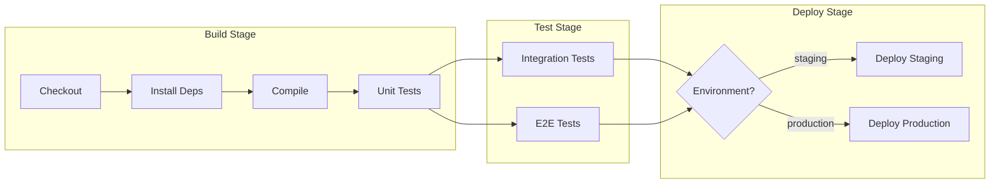
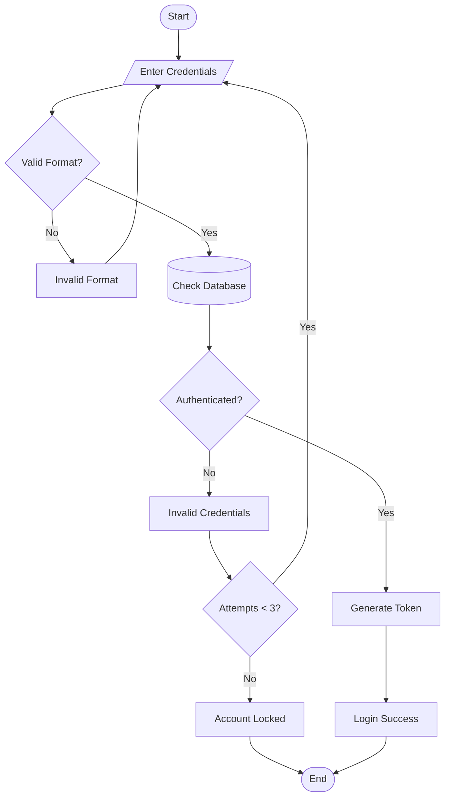
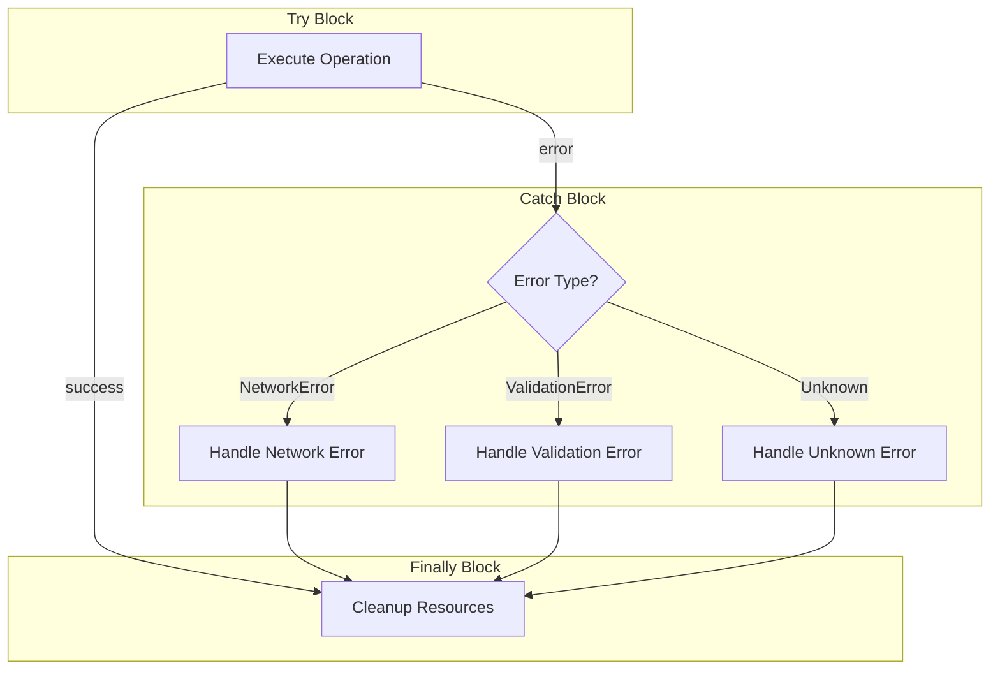
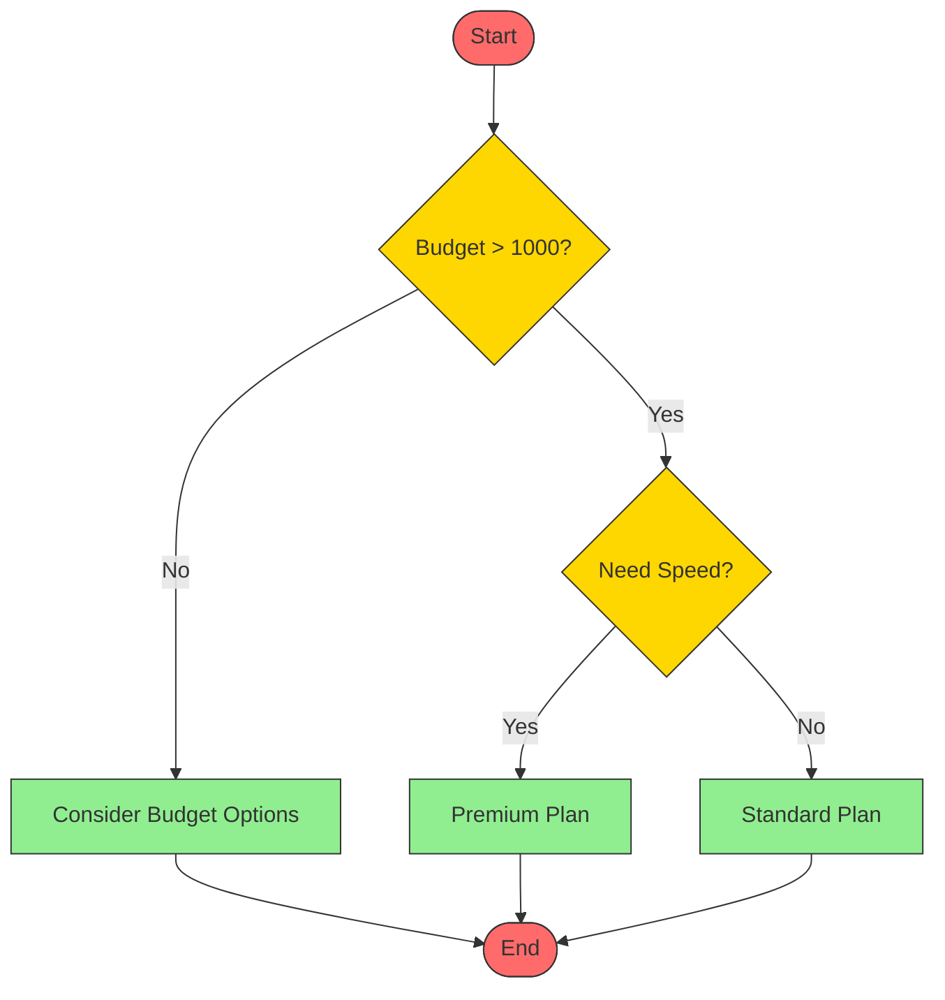
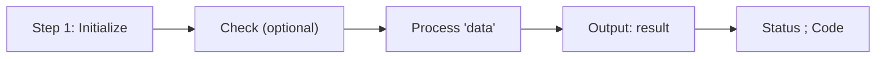
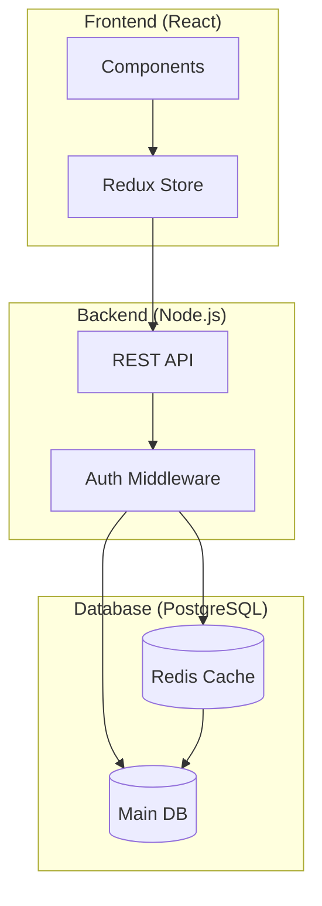
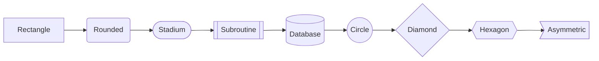
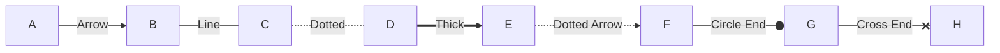

# Flowchart Examples

## Example 1: CI/CD Pipeline

## Example 2: Authentication Flow

## Example 3: Error Handling Pattern

## Example 4: Decision Tree with Styling

## Example 5: Special Characters Handled Correctly

## Example 6: Subgraph with Links

## Example 7: Node Shapes Showcase

## Example 8: Edge Types Showcase

