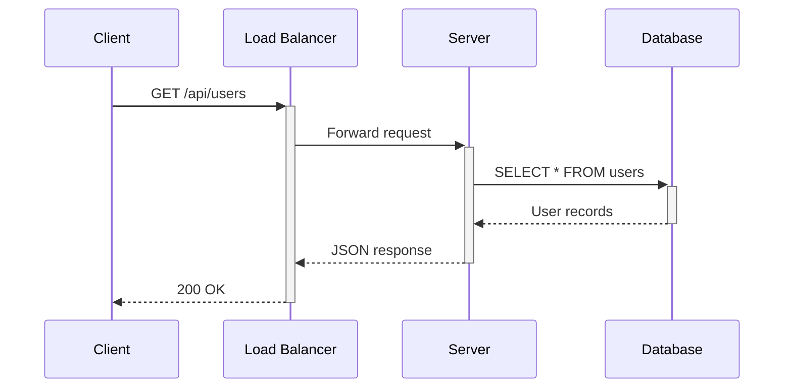
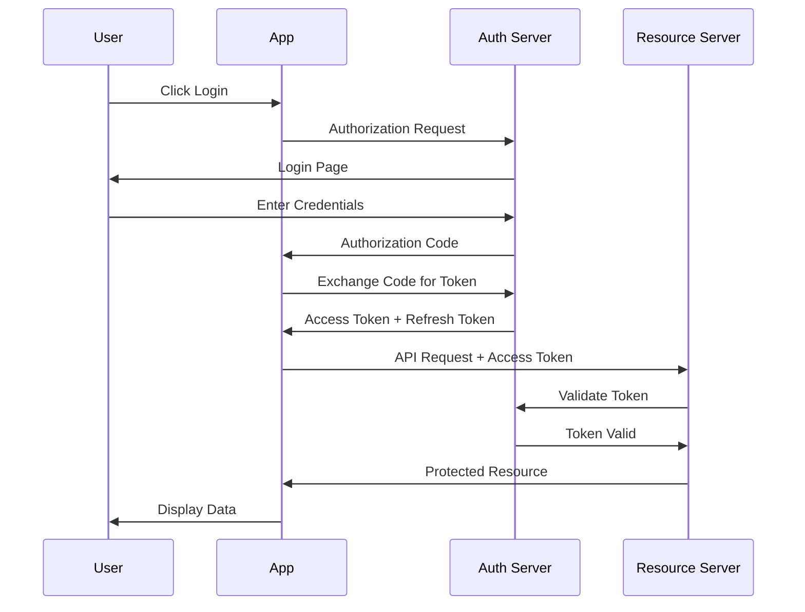
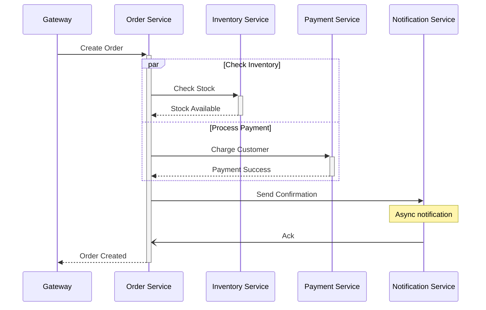
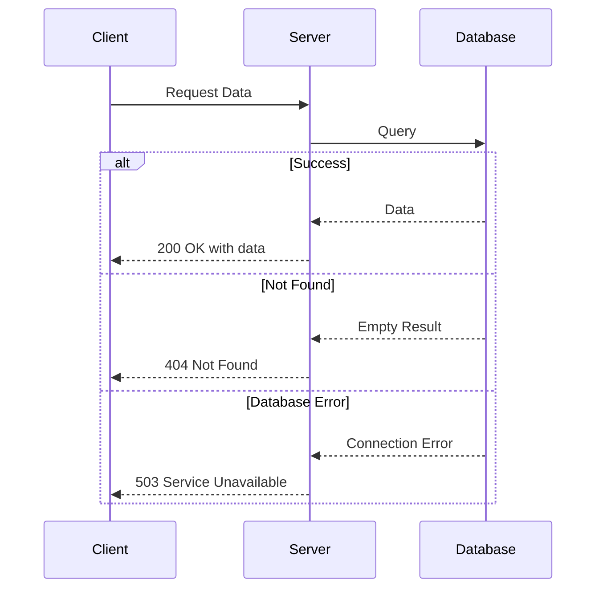
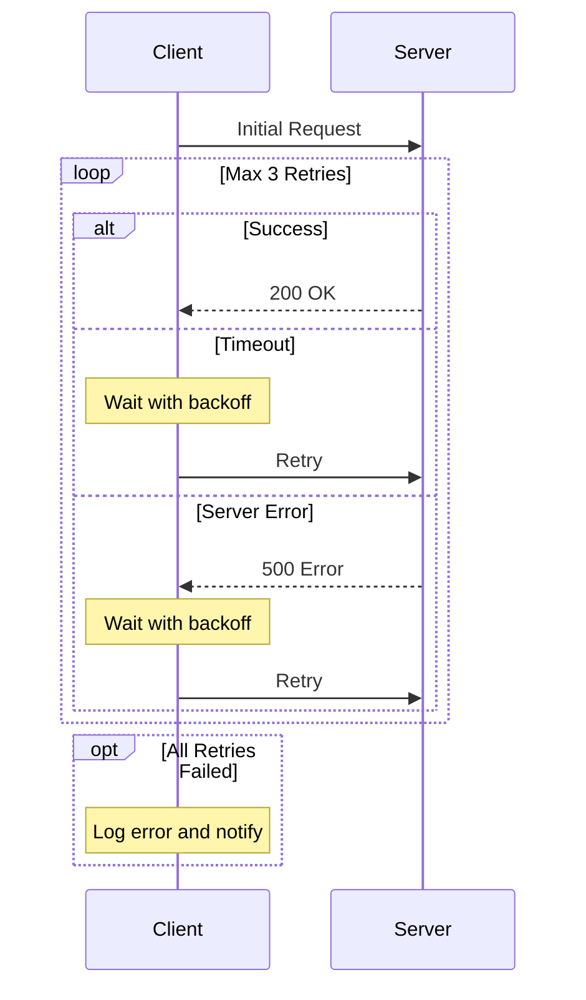
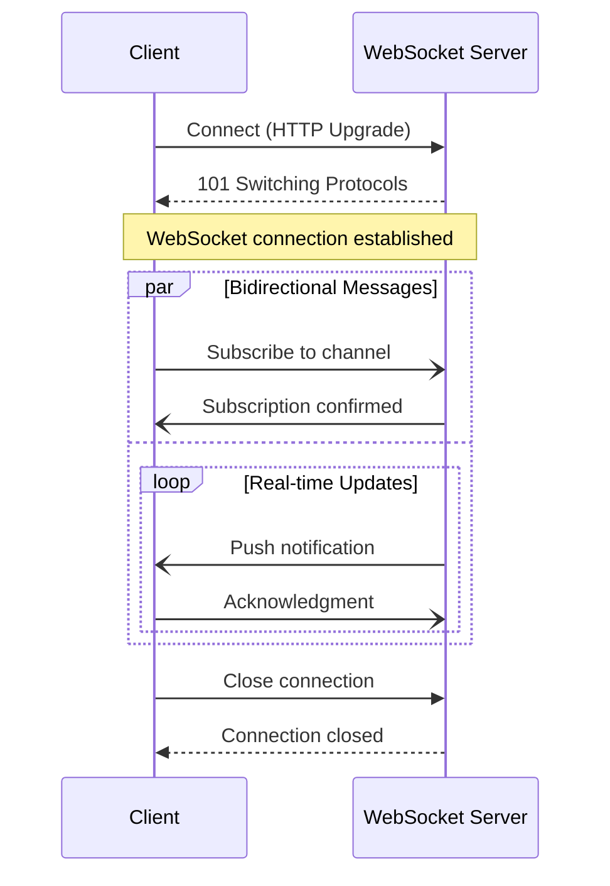
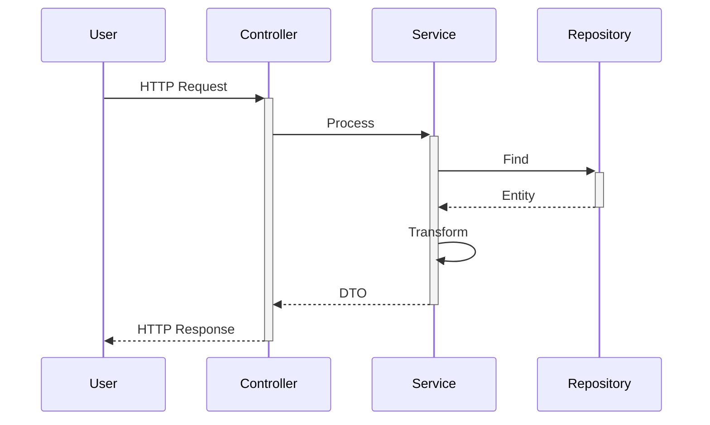
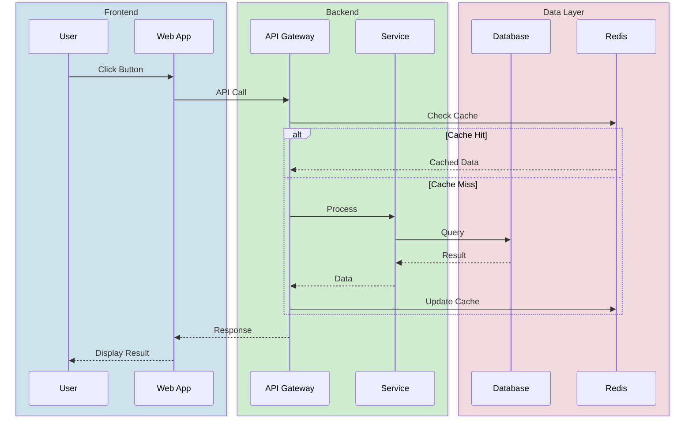
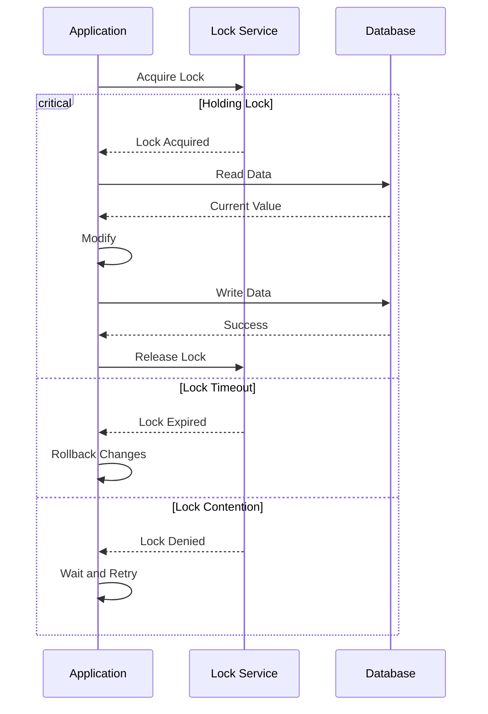
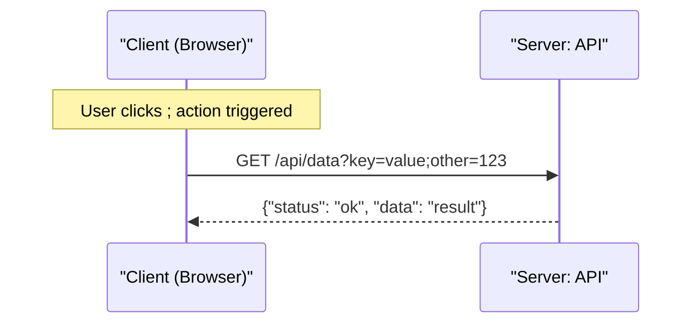

# Sequence Diagram Examples

## Example 1: REST API Request

## Example 2: OAuth2 Authorization Code Flow

## Example 3: Microservices Communication

## Example 4: Error Handling with Alt

## Example 5: Retry Pattern with Loop

## Example 6: WebSocket Communication

## Example 7: Activation and Nested Calls

## Example 8: Box Grouping with Colors

## Example 9: Critical Section

## Example 10: Special Characters Escaped

