# Class Diagram and State Diagram Complete Reference

## Class Diagram

### Class Definition

#### Explicit Definition

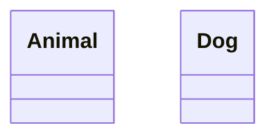

#### Implicit via Relationship

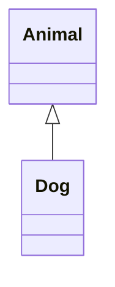

#### With Members

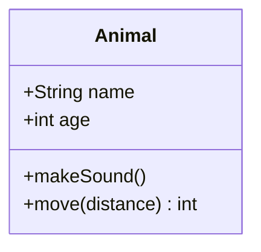

### Visibility Modifiers

| Symbol | Access Level |
|--------|--------------|
| `+` | Public |
| `-` | Private |
| `#` | Protected |
| `~` | Package/Internal |

### Member Types

#### Attributes

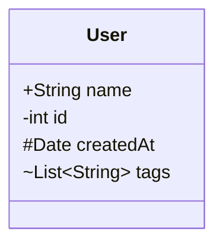

#### Methods

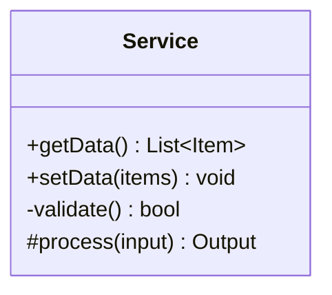

### Method Classifiers

| Classifier | Meaning | Syntax |
|------------|---------|--------|
| Abstract | Must be overridden | `method()* ` |
| Static | Class-level method | `method()$ ` |

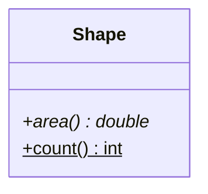

### Return Types

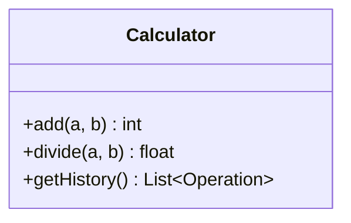

### Generic Types

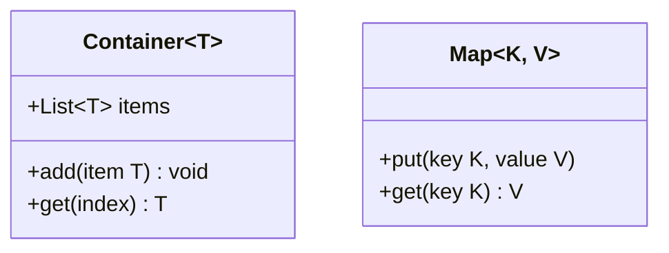

### Relationships

| Syntax | Relationship | Description |
|--------|--------------|-------------|
| `A <\|-- B` | Inheritance | B extends A |
| `A *-- B` | Composition | B is part of A (strong) |
| `A o-- B` | Aggregation | B is part of A (weak) |
| `A --> B` | Association | A uses B |
| `A -- B` | Link (solid) | Related |
| `A ..> B` | Dependency | A depends on B |
| `A ..\|> B` | Realization | A implements B |
| `A .. B` | Link (dashed) | Loosely related |

### Relationship Direction

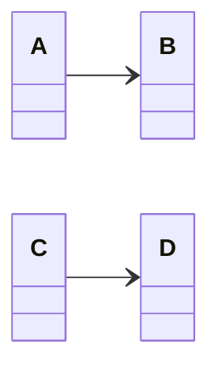

### Labels and Cardinality

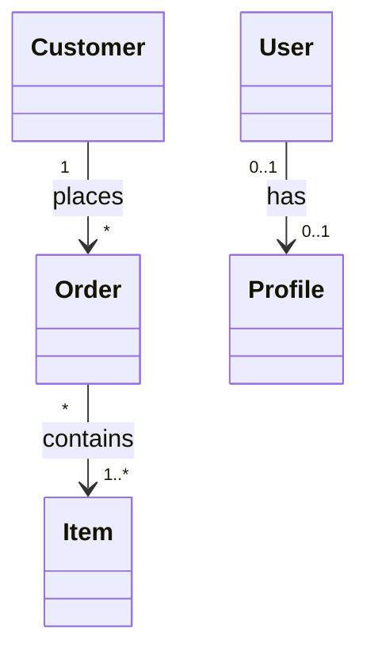

### Annotations

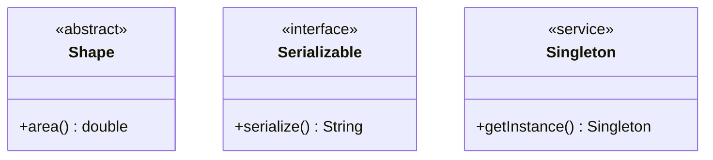

Common annotations: `<<abstract>>`, `<<interface>>`, `<<service>>`, `<<enumeration>>`, `<<entity>>`

### Notes

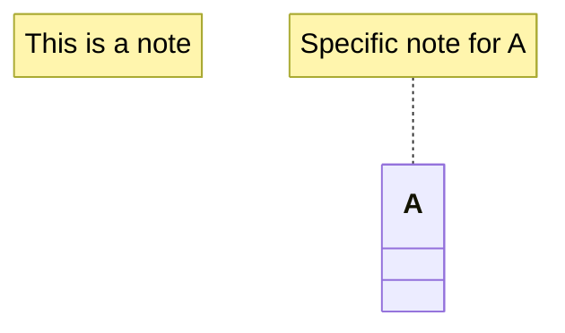

### Namespace

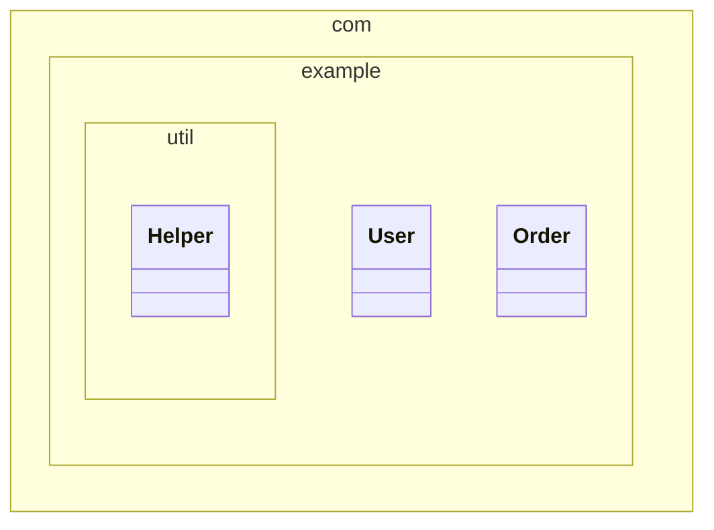

### Styling

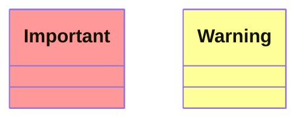

### Click Events

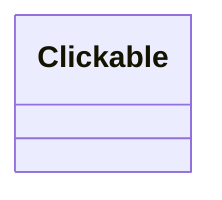

---

## State Diagram

### Version Selection

Use `stateDiagram-v2` for the latest syntax:

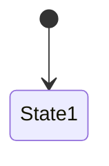

### Basic States

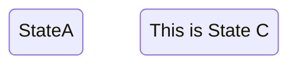

### Transitions

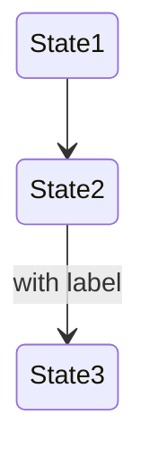

### Start and End States

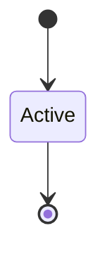

### Composite (Nested) States

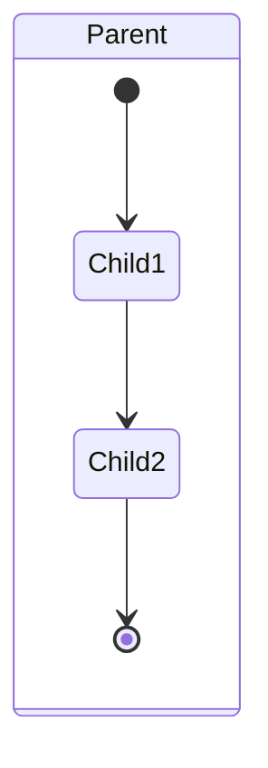

### Deep Nesting

```mermaid
stateDiagram-v2
    state Level1 {
        state Level2 {
            state Level3 {
                A --> B
            }
        }
    }
```

### Choice (Conditional)

```mermaid
stateDiagram-v2
    state choice <<choice>>
    [*] --> IsValid
    IsValid --> choice
    choice --> Approved: if valid
    choice --> Rejected: if invalid
```

### Fork and Join (Parallel)

```mermaid
stateDiagram-v2
    state fork_state <<fork>>
    state join_state <<join>>

    [*] --> fork_state
    fork_state --> Process1
    fork_state --> Process2
    fork_state --> Process3

    Process1 --> join_state
    Process2 --> join_state
    Process3 --> join_state
    join_state --> [*]
```

### Concurrency (Parallel Regions)

```mermaid
stateDiagram-v2
    state Active {
        [*] --> Running
        Running --> Paused
        Paused --> Running
        --
        [*] --> Logging
        Logging --> NotLogging
        NotLogging --> Logging
    }
```

### Notes

```mermaid
stateDiagram-v2
    State1
    note right of State1
        This is a multiline
        note for State1
    end note

    State2
    note left of State2: Single line note
```

### Direction

```mermaid
stateDiagram-v2
    direction LR
    [*] --> A --> B --> C --> [*]
```

Available directions: `TB`, `TD`, `BT`, `LR`, `RL`

### Styling

```mermaid
stateDiagram-v2
    classDef error fill:#f99,stroke:#f00
    classDef success fill:#9f9,stroke:#0f0

    State1:::success
    State2:::error
```

### Common Patterns

#### Order State Machine

```mermaid
stateDiagram-v2
    [*] --> Pending
    Pending --> Processing: payment received
    Processing --> Shipped: items packed
    Shipped --> Delivered: delivered
    Delivered --> [*]

    Processing --> Cancelled: cancel request
    Pending --> Cancelled: cancel request
    Cancelled --> [*]
```

#### Connection State Machine

```mermaid
stateDiagram-v2
    [*] --> Disconnected

    Disconnected --> Connecting: connect()
    Connecting --> Connected: success
    Connecting --> Disconnected: timeout

    Connected --> Disconnected: disconnect()
    Connected --> Reconnecting: connection lost

    Reconnecting --> Connected: reconnected
    Reconnecting --> Disconnected: max retries
```

#### Authentication State Machine

```mermaid
stateDiagram-v2
    [*] --> Anonymous

    state Authenticated {
        [*] --> Active
        Active --> Idle: timeout
        Idle --> Active: activity
        Idle --> [*]: session expired
    }

    Anonymous --> Authenticated: login success
    Authenticated --> Anonymous: logout

    state choice <<choice>>
    Anonymous --> choice: login attempt
    choice --> Anonymous: invalid credentials
    choice --> Authenticated: valid credentials
```

## Entity Relationship Diagram (Bonus)

### Basic Syntax

```mermaid
erDiagram
    CUSTOMER ||--o{ ORDER : places
    ORDER ||--|{ LINE-ITEM : contains
    CUSTOMER }|..|{ DELIVERY-ADDRESS : uses
```

### Cardinality Symbols

| Value (left) | Value (right) | Meaning |
|--------------|---------------|---------|
| `\|o` | `o\|` | Zero or one |
| `\|\|` | `\|\|` | Exactly one |
| `}o` | `o{` | Zero or more |
| `}\|` | `\|{` | One or more |

### Relationship Lines

| Line | Meaning |
|------|---------|
| `--` | Solid (identifying) |
| `..` | Dashed (non-identifying) |

### Attributes

```mermaid
erDiagram
    CUSTOMER {
        int id PK
        string name
        string email UK
        date created_at
    }
    ORDER {
        int id PK
        int customer_id FK
        date order_date
        float total
    }
    CUSTOMER ||--o{ ORDER : places
```

### Attribute Types

- `PK` - Primary Key
- `FK` - Foreign Key
- `UK` - Unique Key

### Comments

```mermaid
erDiagram
    %% This is a comment
    ENTITY1 ||--o{ ENTITY2 : relationship
```
