# Flowchart Complete Syntax Reference

## All Node Shapes (v11.3.0+)

### Standard Shapes

| Shape | Syntax | Use Case |
|-------|--------|----------|
| Rectangle | `A[text]` | Process, action |
| Rounded | `A(text)` | Start/end, soft action |
| Stadium | `A([text])` | Terminal, UI element |
| Subroutine | `A[[text]]` | Predefined process |
| Cylinder | `A[(text)]` | Database, storage |
| Circle | `A((text))` | Connector, event |
| Diamond | `A{text}` | Decision |
| Hexagon | `A{{text}}` | Preparation |
| Asymmetric | `A>text]` | Input/output |

### Extended Shapes (v11.3.0+)

Use `@{ shape: shapeName }` syntax:

```mermaid
flowchart LR
    A@{ shape: parallelogram, label: "Input" }
    B@{ shape: parallelogram-alt, label: "Output" }
    C@{ shape: trapezoid, label: "Manual Op" }
    D@{ shape: trapezoid-alt, label: "Alt Manual" }
    E@{ shape: document, label: "Document" }
    F@{ shape: notch-rect, label: "Card" }
    G@{ shape: lined-cylinder, label: "Disk" }
    H@{ shape: curly-braces, label: "Comment" }
```

### All Extended Shape Names

**Process shapes:**
- `rect` - Rectangle
- `rounded` - Rounded rectangle
- `stadium` - Stadium shape
- `subroutine` - Double-bordered rectangle
- `process` - Process box

**Data shapes:**
- `parallelogram` - Input (slant right)
- `parallelogram-alt` - Output (slant left)
- `trapezoid` - Manual operation
- `trapezoid-alt` - Alt manual operation
- `document` - Document with wavy bottom
- `lined-document` - Document with line
- `notch-rect` - Card (notched corner)

**Storage shapes:**
- `cylinder` - Database
- `lined-cylinder` - Disk storage
- `stored-data` - Data store

**Decision/Logic:**
- `diamond` - Decision
- `odd` - Odd shape (preparation)
- `lean-right` - Lean right
- `lean-left` - Lean left

**Special:**
- `circle` - Circle
- `dbl-circle` - Double circle
- `fr-circle` - Framed circle
- `sm-circle` - Small circle
- `curly-braces` - Comment/annotation
- `tag-rect` - Tagged rectangle
- `fork` - Fork/join bar
- `hourglass` - Hourglass

### Icon Nodes

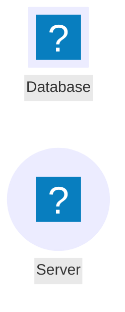

### Image Nodes

```mermaid
flowchart LR
    A@{ img: "https://example.com/logo.png", label: "Logo", w: 60, h: 60 }
```

## Edge Types Complete

### Basic Edges

| Type | Syntax | Description |
|------|--------|-------------|
| Arrow | `-->` | Standard arrow |
| Open | `---` | Line without arrow |
| Dotted | `-.-` | Dotted line |
| Dotted arrow | `-.->` | Dotted with arrow |
| Thick | `===` | Thick line |
| Thick arrow | `==>` | Thick with arrow |
| Invisible | `~~~` | Hidden connection |

### Special Edge Endings

| Type | Syntax | Description |
|------|--------|-------------|
| Circle | `--o` | Circle end |
| Cross | `--x` | Cross end |
| Arrow both | `<-->` | Bidirectional |

### Edge with Text

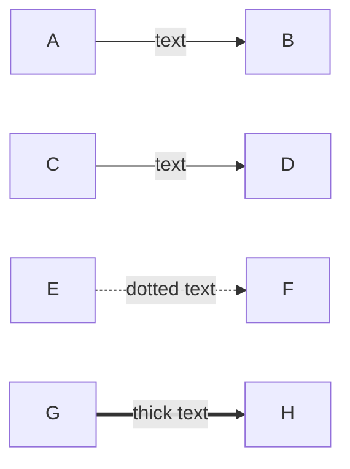

### Edge Length Control

Add dashes to increase minimum length:

```mermaid
flowchart LR
    A --> B          %% 1 rank
    C ---> D         %% 2 ranks
    E ----> F        %% 3 ranks
    G -----> H       %% 4 ranks
```

### Edge IDs and Animation (v11.3.0+)

```mermaid
flowchart LR
    A e1@--> B
    B e2@==> C
    style e1 stroke:red
    animate e2 { animate: true, speed: fast }
```

## Subgraph Complete Syntax

### Basic Subgraph

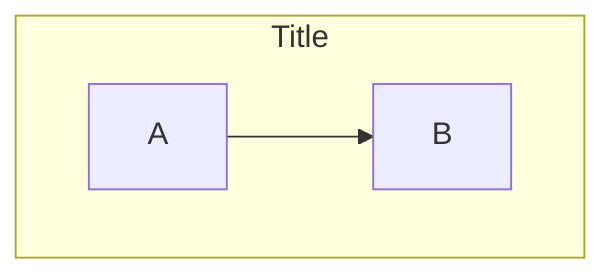

### Nested Subgraphs

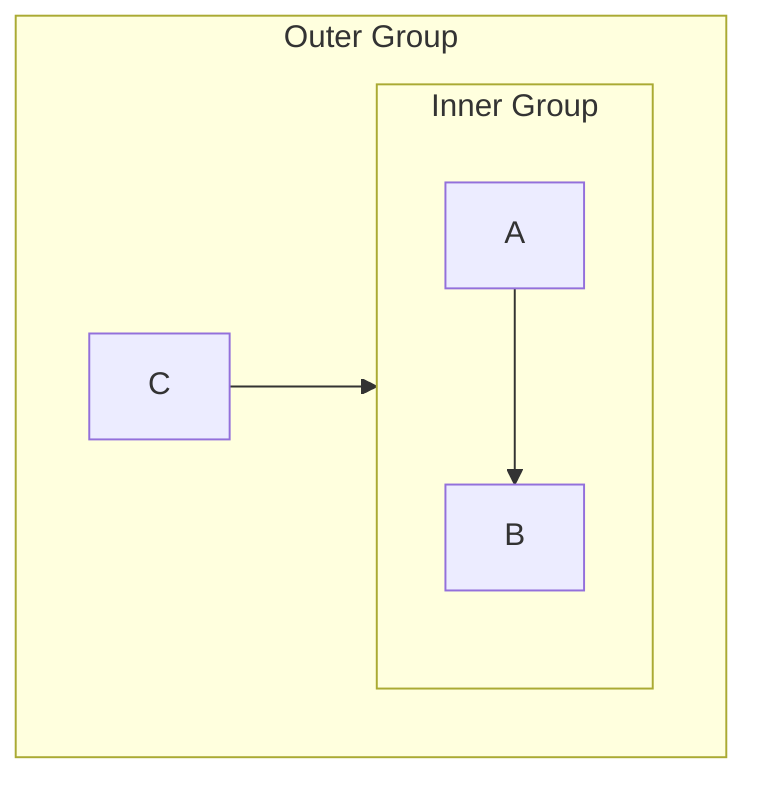

### Subgraph Direction

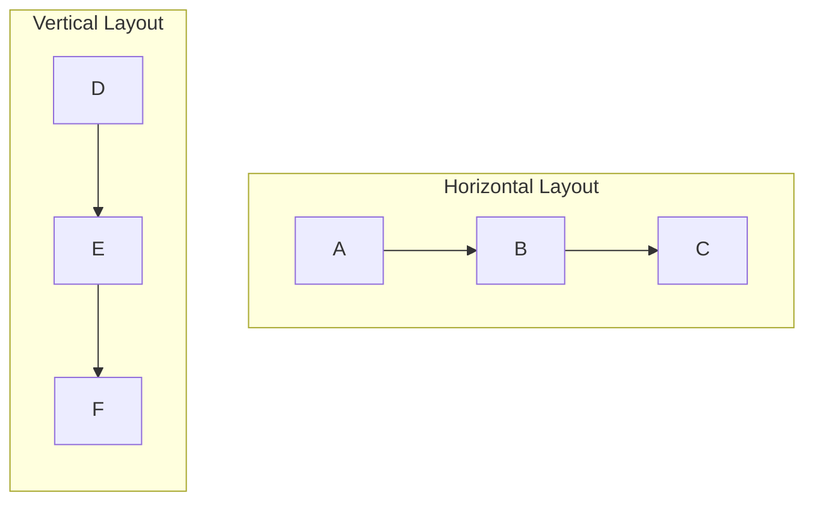

### Linking to Subgraphs

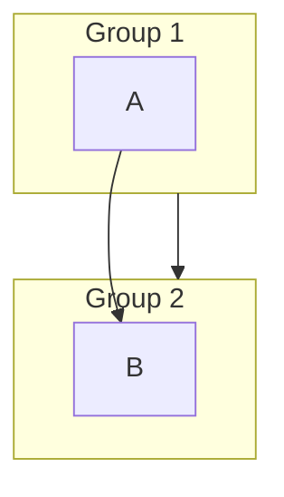

## Styling

### Individual Node Styling

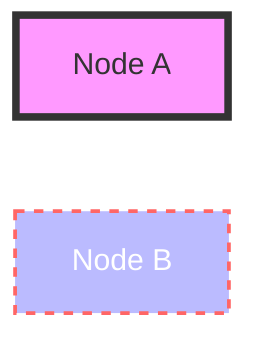

### Class Definitions

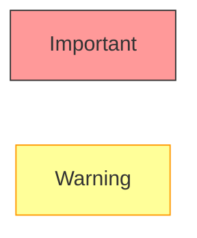

### Inline Class Application

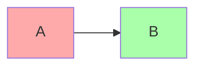

### Default Class

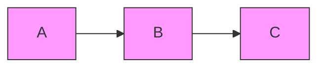

### Link Styling

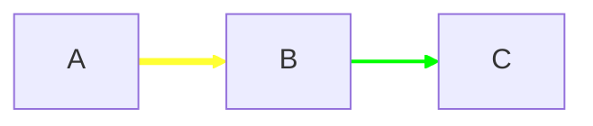

### Link Style by Edge ID

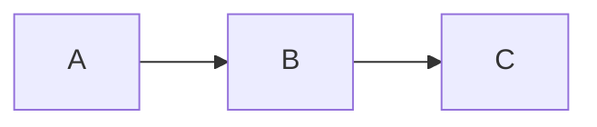

## Click Events and Links

### URL Links


### JavaScript Callbacks


### Target Options

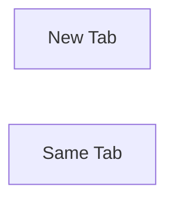

## Comments

```mermaid
flowchart LR
    %% This is a comment
    A --> B %% Inline comment
```

## Markdown Strings

```mermaid
flowchart LR
    A["`**Bold** and *italic*`"]
    B["`Multiline
    text here`"]
```

## Escaping Special Characters

### Quote Wrapping

```mermaid
flowchart LR
    A["Text with (parentheses)"]
    B["Colon: here"]
    C["Semicolon; here"]
```

### HTML Entities

| Character | Entity |
|-----------|--------|
| `#` | `&#35;` or `#35;` |
| `;` | `&#59;` or `#59;` |
| `"` | `&#34;` or `#quot;` |
| `<` | `&#60;` or `#lt;` |
| `>` | `&#62;` or `#gt;` |
| `&` | `&#38;` or `#amp;` |

## Common Patterns

### Decision Tree

```mermaid
flowchart TD
    Start([Start]) --> Check{Condition?}
    Check -->|Yes| Action1[Do This]
    Check -->|No| Action2[Do That]
    Action1 --> End([End])
    Action2 --> End
```

### Process Flow with Database

```mermaid
flowchart LR
    Input[/Input/] --> Process[Process]
    Process --> DB[(Database)]
    DB --> Output[/Output/]
```

### Parallel Processes

```mermaid
flowchart TB
    Start --> Fork{Fork}
    Fork --> A[Task A]
    Fork --> B[Task B]
    Fork --> C[Task C]
    A --> Join{Join}
    B --> Join
    C --> Join
    Join --> End
```
