# Other Mermaid Diagram Types

Complete reference for Gantt, Pie, Git Graph, Mindmap, Timeline, and other diagram types.

## Gantt Chart

### Basic Syntax

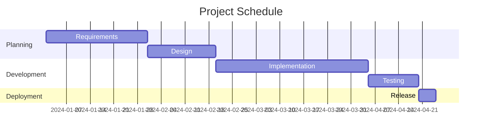

### Date Formats

| Format | Example |
|--------|---------|
| `YYYY-MM-DD` | 2024-01-15 |
| `DD-MM-YYYY` | 15-01-2024 |
| `YYYY-MM-DDTHH:mm` | 2024-01-15T09:00 |

### Task Status

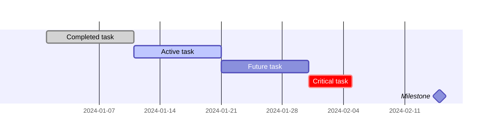

### Task Dependencies

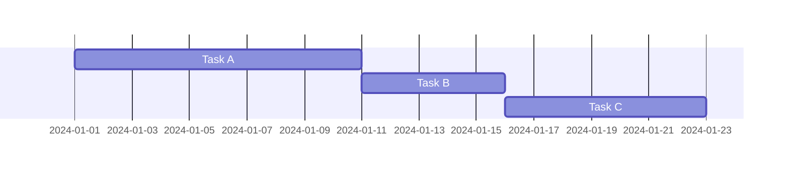

### Excluding Weekends

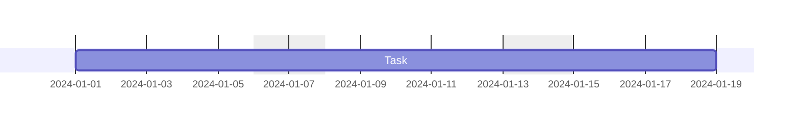

### Custom Weekend Days (v11)

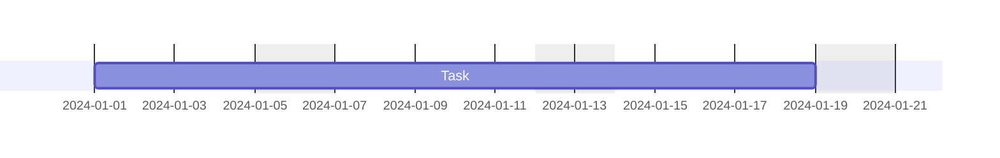

---

## Pie Chart

### Basic Syntax

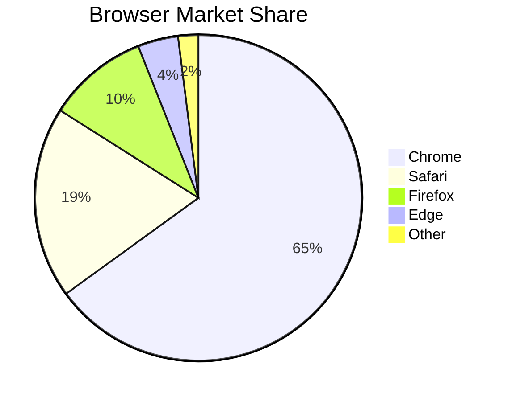

### With showData

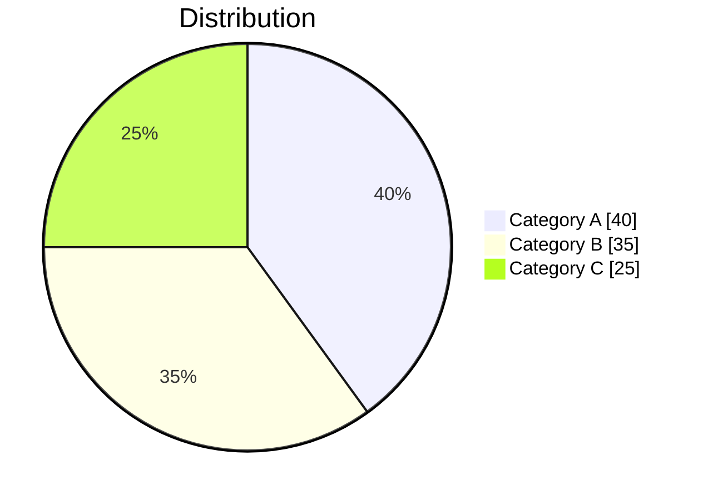

### Configuration

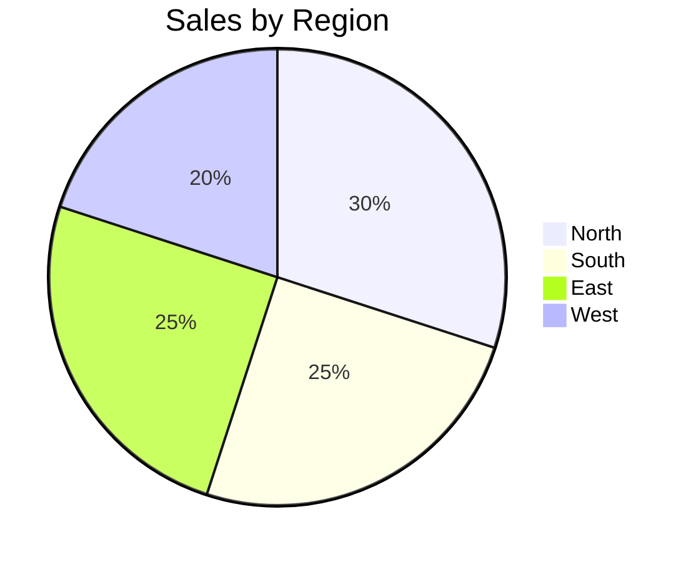

---

## Git Graph

### Basic Syntax

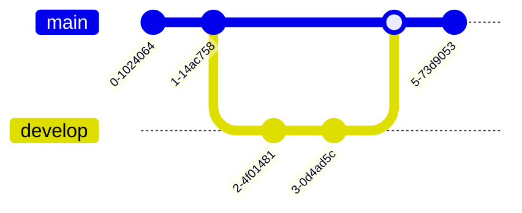

### With Commit IDs and Messages

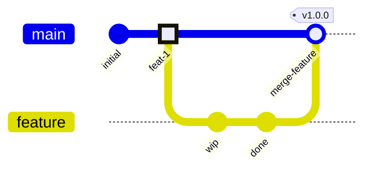

### Commit Types

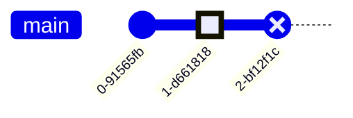

### Branch Order

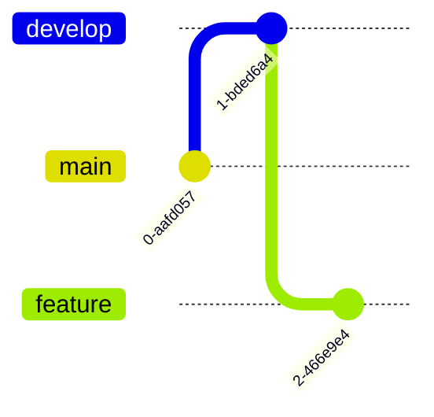

### Bottom-to-Top (v11)

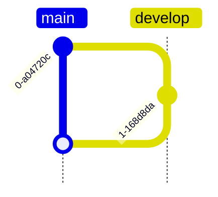

### Cherry-Pick

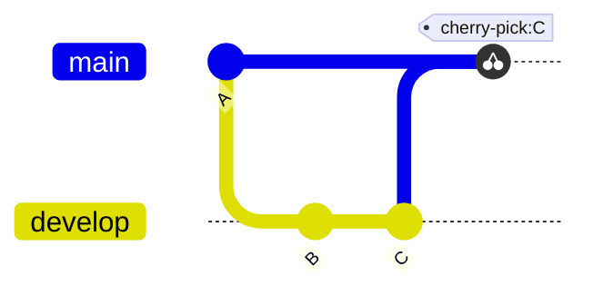

---

## Mindmap

### Basic Syntax

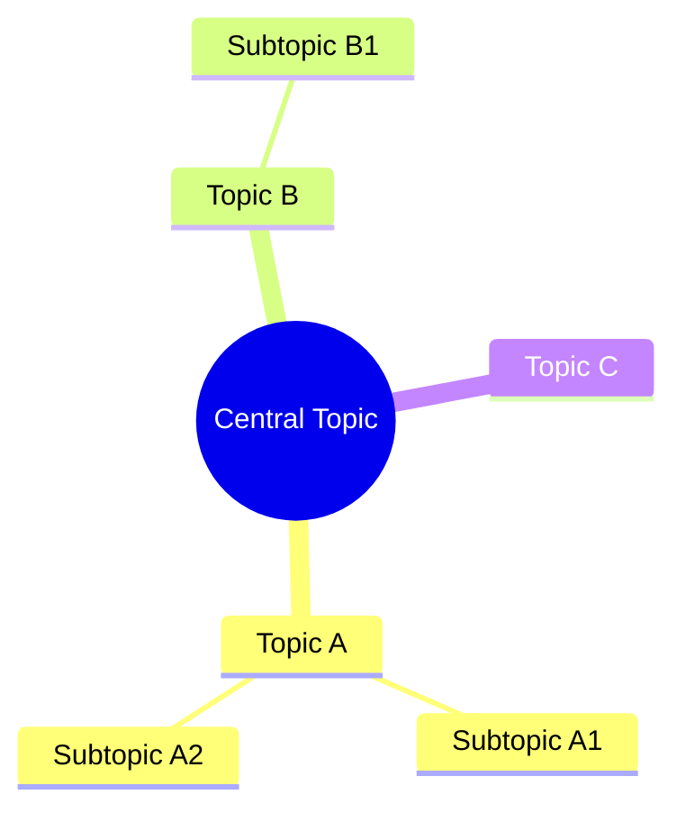

### Node Shapes

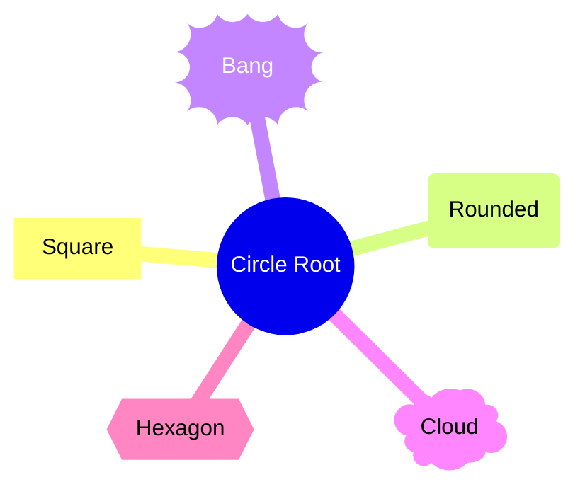

### Icons (v11)

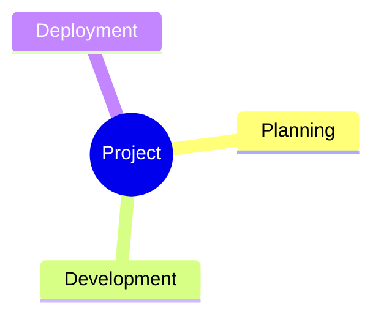

---

## Timeline

### Basic Syntax

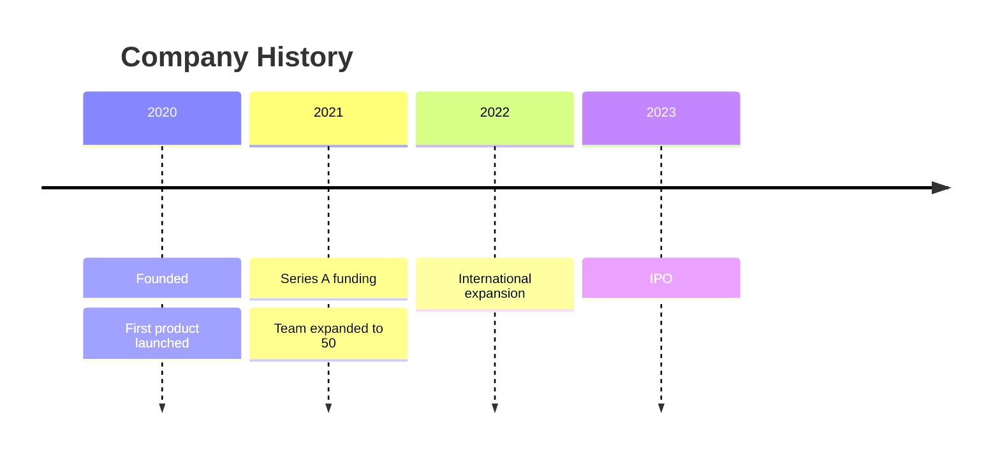

### Sections

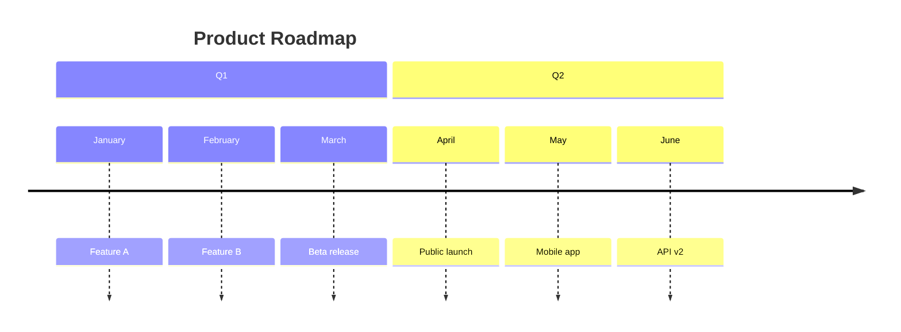

### With Hashtags and Semicolons (v11)

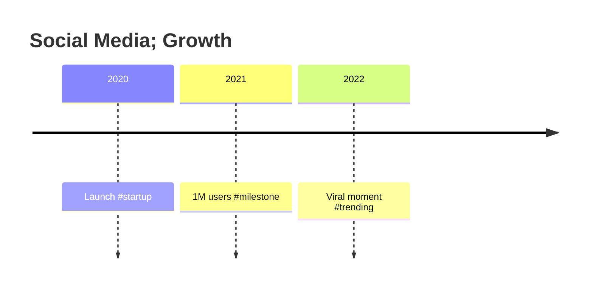

---

## Quadrant Chart

### Basic Syntax

```mermaid
quadrantChart
    title Technology Assessment
    x-axis Low Effort --> High Effort
    y-axis Low Impact --> High Impact
    quadrant-1 Quick Wins
    quadrant-2 Major Projects
    quadrant-3 Fill-ins
    quadrant-4 Thankless Tasks

    Campaign A: [0.3, 0.6]
    Campaign B: [0.45, 0.23]
    Campaign C: [0.57, 0.69]
    Campaign D: [0.78, 0.34]
```

### Point Styling (v11)

```mermaid
quadrantChart
    Campaign A:::important: [0.3, 0.6]
    Campaign B:::warning: [0.45, 0.23]
```

---

## XY Chart (v11)

### Bar Chart

```mermaid
xychart-beta
    title "Sales Revenue"
    x-axis [Jan, Feb, Mar, Apr, May]
    y-axis "Revenue (K)" 0 --> 100
    bar [50, 60, 75, 80, 95]
```

### Line Chart

```mermaid
xychart-beta
    title "Stock Price"
    x-axis [Mon, Tue, Wed, Thu, Fri]
    y-axis "Price ($)" 100 --> 150
    line [102, 130, 118, 140, 145]
```

### Combined

```mermaid
xychart-beta
    title "Sales vs Target"
    x-axis [Q1, Q2, Q3, Q4]
    y-axis "Amount (M)" 0 --> 50
    bar [20, 25, 30, 40]
    line [25, 28, 32, 38]
```

---

## Block Diagram (v11)

### Basic Syntax

```mermaid
block-beta
    columns 3

    A["Frontend"]:1
    B["API Gateway"]:1
    C["Backend"]:1

    A --> B --> C
```

### Complex Layout

```mermaid
block-beta
    columns 4

    block:group1:2
        A["Service A"]
        B["Service B"]
    end

    block:group2:2
        C["Service C"]
        D["Service D"]
    end
```

---

## Sankey Diagram (v11)

### Basic Syntax

```mermaid
sankey-beta

Source A,Target X,100
Source A,Target Y,50
Source B,Target Y,75
Source B,Target Z,25
```

---

## Packet Diagram (v11)

### Basic Syntax

```mermaid
packet-beta
    0-15: "Header"
    16-31: "Payload Length"
    32-47: "Sequence Number"
    48-63: "Data"
```

---

## Architecture Diagram (v11)

### Basic Syntax

```mermaid
architecture-beta
    group api(cloud)[API]

    service db(database)[Database] in api
    service disk1(disk)[Storage] in api
    service server(server)[Server] in api

    db:L -- R:server
    disk1:T -- B:server
```

---

## Common Configuration Options

### Theme Selection

```mermaid
%%{init: {"theme": "forest"}}%%
```

Available themes: `default`, `forest`, `dark`, `neutral`, `base`

### Font and Size

```mermaid
%%{init: {
    "themeVariables": {
        "fontSize": "16px",
        "fontFamily": "Arial"
    }
}}%%
```

### Diagram-Specific Config

```mermaid
%%{init: {
    "gantt": {
        "titleTopMargin": 25,
        "barHeight": 20,
        "barGap": 4
    }
}}%%
```
