# Sequence Diagram Complete Syntax Reference

## Participants

### Basic Participant Types

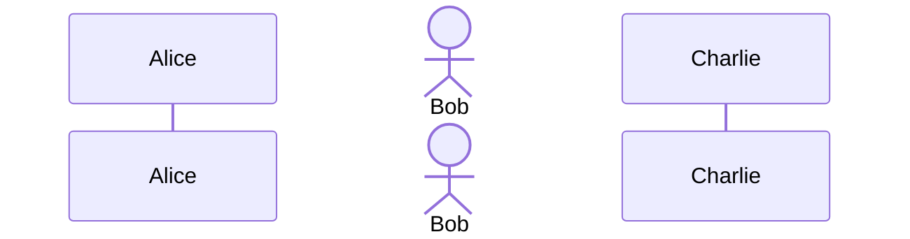
```mermaid
sequenceDiagram
    participant A as Alice
    actor B as Bob
    participant C as Charlie
```

### Extended Participant Types (JSON syntax)

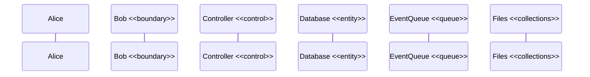
```mermaid
sequenceDiagram
    participant A as Alice
    participant B as Bob <<boundary>>
    participant C as Controller <<control>>
    participant D as Database <<entity>>
    participant E as EventQueue <<queue>>
    participant F as Files <<collections>>
```

### Participant Order

Participants appear in declaration order. Explicit declaration controls layout:

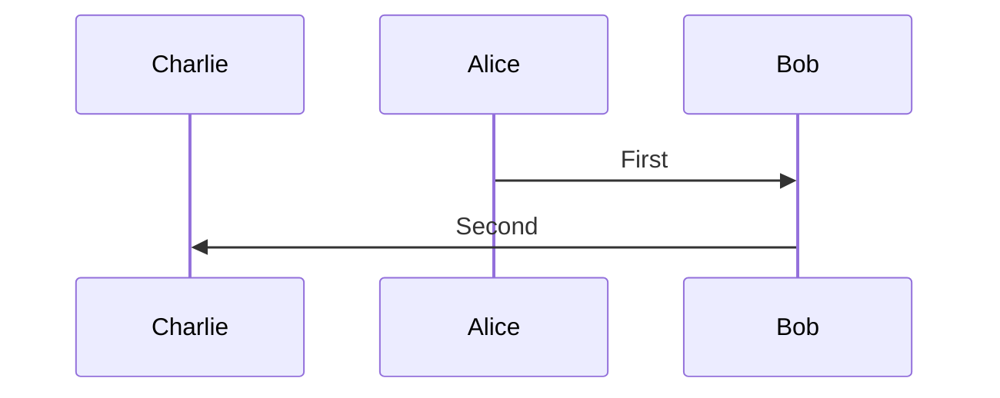
```mermaid
sequenceDiagram
    participant C as Charlie
    participant A as Alice
    participant B as Bob
    A->>B: First
    B->>C: Second
```

### Participant Creation and Destruction

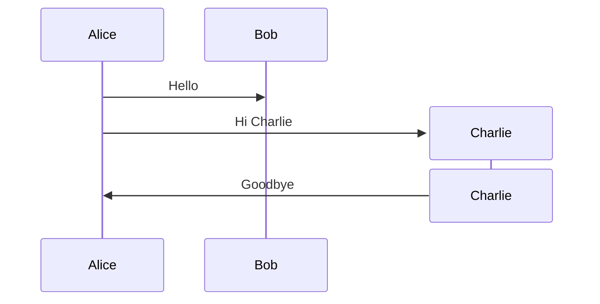
```mermaid
sequenceDiagram
    Alice->>Bob: Hello
    create participant Charlie
    Alice->>Charlie: Hi Charlie
    destroy Charlie
    Charlie->>Alice: Goodbye
```

## Message Types

### All Arrow Types

| Syntax | Description |
|--------|-------------|
| `->` | Solid line, no arrowhead |
| `-->` | Dotted line, no arrowhead |
| `->>` | Solid line, arrowhead |
| `-->>` | Dotted line, arrowhead |
| `-x` | Solid line, cross end (lost message) |
| `--x` | Dotted line, cross end |
| `-)` | Solid line, open arrow (async) |
| `--)` | Dotted line, open arrow |
| `<<->>` | Bidirectional solid arrows |
| `<<-->>` | Bidirectional dotted arrows |

### Message with Text

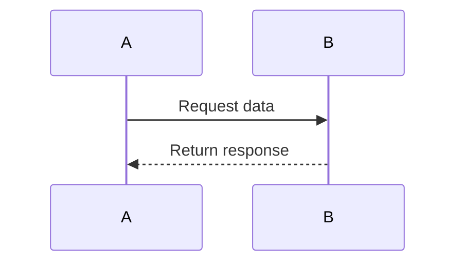
```mermaid
sequenceDiagram
    A->>B: Request data
    B-->>A: Return response
```

### Self-Message

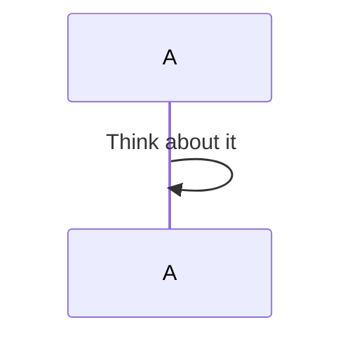
```mermaid
sequenceDiagram
    A->>A: Think about it
```

## Activation

### Shorthand Syntax

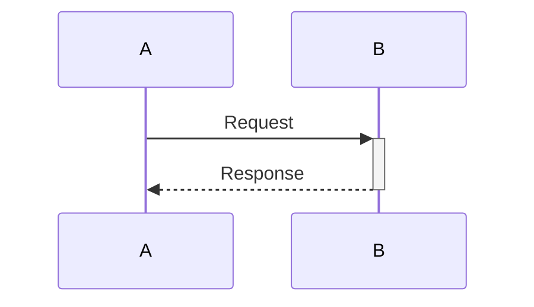
```mermaid
sequenceDiagram
    A->>+B: Request
    B-->>-A: Response
```

### Explicit Activation

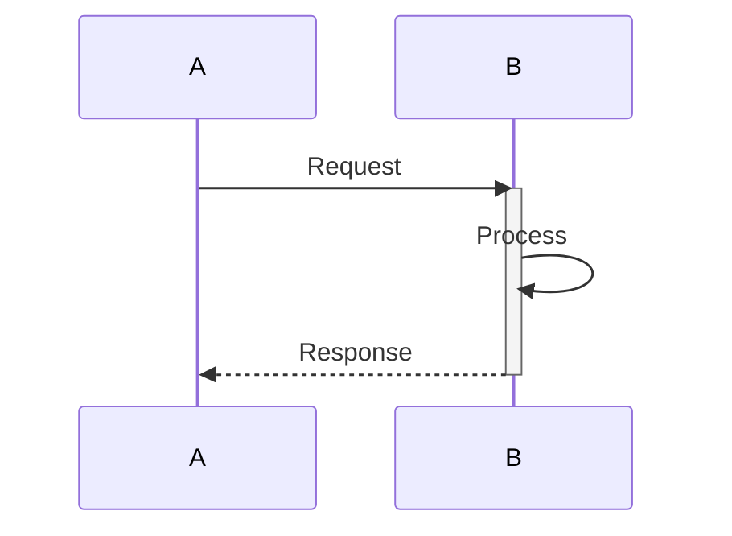
```mermaid
sequenceDiagram
    A->>B: Request
    activate B
    B->>B: Process
    B-->>A: Response
    deactivate B
```

### Nested Activation

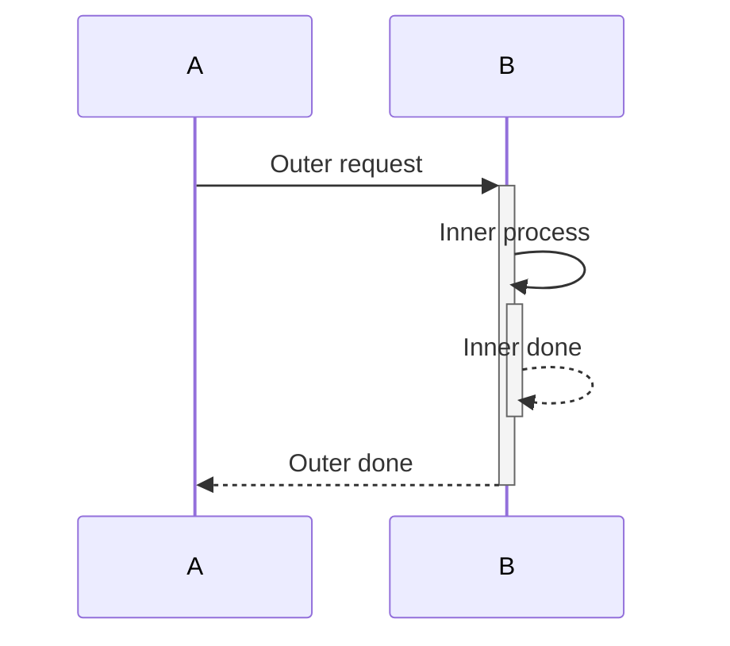
```mermaid
sequenceDiagram
    A->>+B: Outer request
    B->>+B: Inner process
    B-->>-B: Inner done
    B-->>-A: Outer done
```

### Stacked Activation

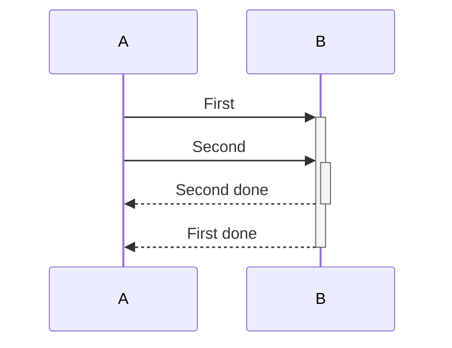
```mermaid
sequenceDiagram
    A->>+B: First
    A->>+B: Second
    B-->>-A: Second done
    B-->>-A: First done
```

## Notes

### Note Positions

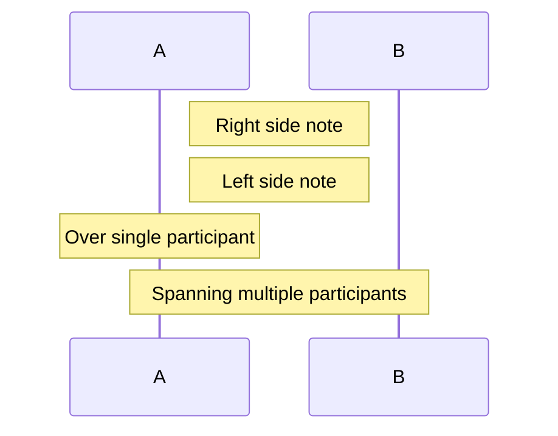
```mermaid
sequenceDiagram
    participant A
    participant B
    Note right of A: Right side note
    Note left of B: Left side note
    Note over A: Over single participant
    Note over A,B: Spanning multiple participants
```

### Multiline Notes

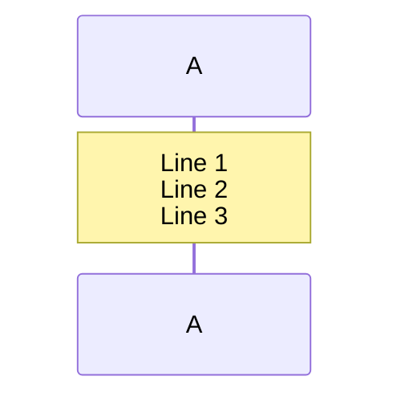
```mermaid
sequenceDiagram
    Note over A: Line 1<br/>Line 2<br/>Line 3
```

## Grouping (Boxes)

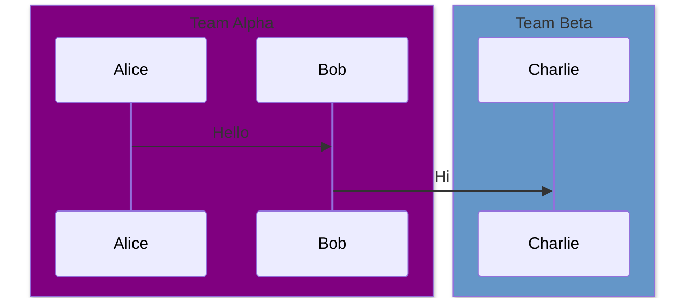
```mermaid
sequenceDiagram
    box Purple Team Alpha
        participant A as Alice
        participant B as Bob
    end
    box rgb(100, 150, 200) Team Beta
        participant C as Charlie
    end
    A->>B: Hello
    B->>C: Hi
```

## Control Flow

### Loop

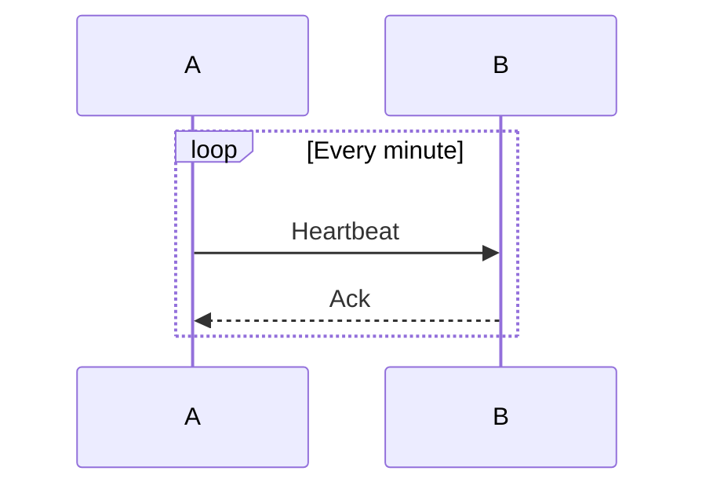
```mermaid
sequenceDiagram
    loop Every minute
        A->>B: Heartbeat
        B-->>A: Ack
    end
```

### Alternative (if-else)

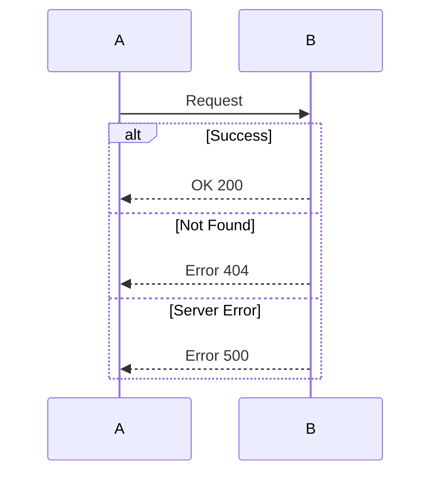
```mermaid
sequenceDiagram
    A->>B: Request
    alt Success
        B-->>A: OK 200
    else Not Found
        B-->>A: Error 404
    else Server Error
        B-->>A: Error 500
    end
```

### Optional

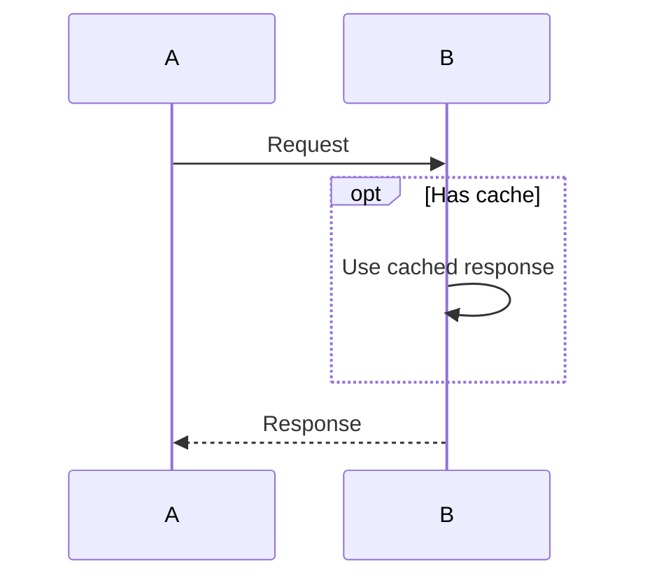
```mermaid
sequenceDiagram
    A->>B: Request
    opt Has cache
        B->>B: Use cached response
    end
    B-->>A: Response
```

### Parallel

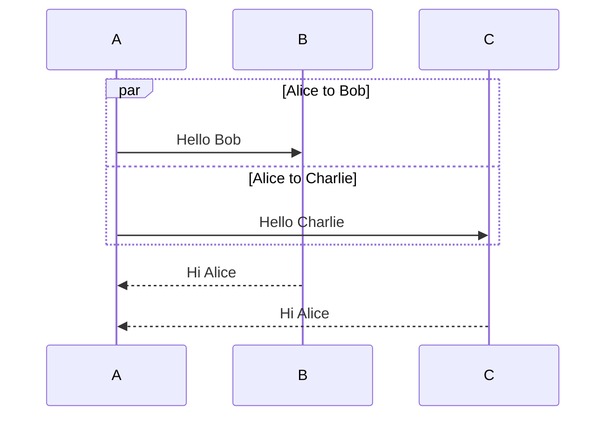
```mermaid
sequenceDiagram
    par Alice to Bob
        A->>B: Hello Bob
    and Alice to Charlie
        A->>C: Hello Charlie
    end
    B-->>A: Hi Alice
    C-->>A: Hi Alice
```

### Nested Parallel

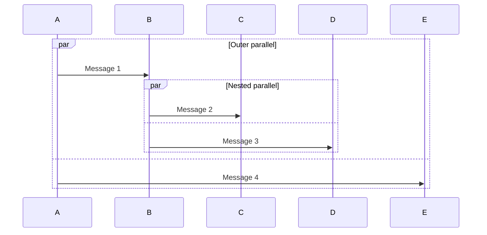
```mermaid
sequenceDiagram
    par Outer parallel
        A->>B: Message 1
        par Nested parallel
            B->>C: Message 2
        and
            B->>D: Message 3
        end
    and
        A->>E: Message 4
    end
```

### Critical Region

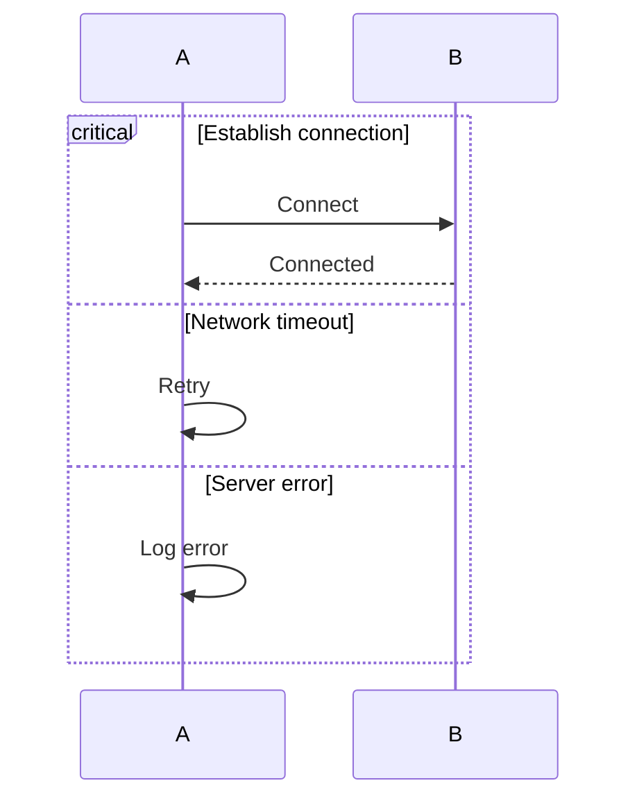
```mermaid
sequenceDiagram
    critical Establish connection
        A->>B: Connect
        B-->>A: Connected
    option Network timeout
        A->>A: Retry
    option Server error
        A->>A: Log error
    end
```

### Break

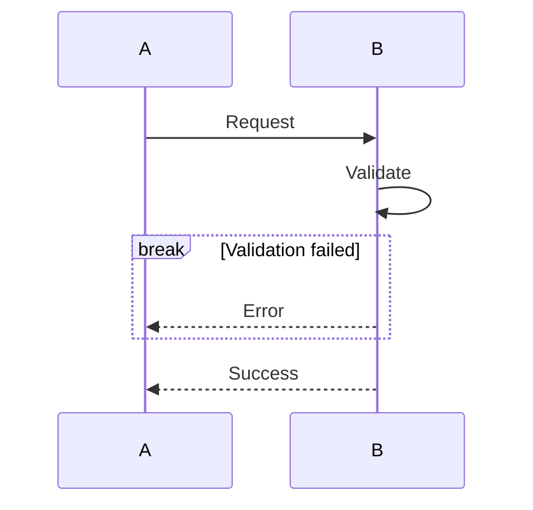
```mermaid
sequenceDiagram
    A->>B: Request
    B->>B: Validate
    break Validation failed
        B-->>A: Error
    end
    B-->>A: Success
```

## Background Highlighting

```mermaid
sequenceDiagram
    rect rgb(200, 255, 200)
        A->>B: Step 1
        B->>C: Step 2
    end
    rect rgba(255, 200, 200, 0.5)
        C->>D: Step 3
    end
```

## Sequence Numbers

Enable with directive:

```mermaid
sequenceDiagram
    autonumber
    A->>B: First
    B->>C: Second
    C-->>A: Third
```

## Links and Menus

### Simple Link

```mermaid
sequenceDiagram
    participant A as Alice
    link A: Dashboard @ https://dashboard.example.com
    link A: Wiki @ https://wiki.example.com
```

### Links with JSON

```mermaid
sequenceDiagram
    participant A as Alice
    links A: {"Dashboard": "https://dashboard.example.com", "Wiki": "https://wiki.example.com"}
```

## Comments

```mermaid
sequenceDiagram
    %% This is a comment
    A->>B: Message %% Inline comment
```

## Escaping Characters

### Semicolon (Line Break)

```mermaid
sequenceDiagram
    A->>B: key#59;value#59;data
```

### Special Characters

| Character | Escape |
|-----------|--------|
| `;` | `#59;` |
| `#` | `#35;` |
| `<` | `#lt;` |
| `>` | `#gt;` |
| newline | ` ` |

## Configuration Directives

```mermaid
%%{init: {
    'sequence': {
        'mirrorActors': false,
        'showSequenceNumbers': true,
        'actorFontSize': 14,
        'messageFontSize': 12,
        'noteMargin': 10
    }
}}%%
sequenceDiagram
    A->>B: Configured diagram
```

## Common Patterns

### API Request Flow

```mermaid
sequenceDiagram
    participant C as Client
    participant S as Server
    participant DB as Database

    C->>+S: POST /api/users
    S->>+DB: INSERT user
    DB-->>-S: user_id
    S-->>-C: 201 Created
```

### Authentication Flow

```mermaid
sequenceDiagram
    participant U as User
    participant A as Auth Server
    participant R as Resource Server

    U->>A: Login (username, password)
    A->>A: Validate credentials
    alt Valid
        A-->>U: Access Token
        U->>R: Request + Token
        R->>A: Validate Token
        A-->>R: Token Valid
        R-->>U: Protected Resource
    else Invalid
        A-->>U: 401 Unauthorized
    end
```

### Retry Pattern

```mermaid
sequenceDiagram
    participant C as Client
    participant S as Server

    C->>S: Request
    loop Max 3 retries
        alt Success
            S-->>C: Response
        else Timeout
            C->>C: Wait exponential backoff
            C->>S: Retry request
        end
    end
```

### Event-Driven Pattern

```mermaid
sequenceDiagram
    participant P as Producer
    participant Q as Queue
    participant C1 as Consumer 1
    participant C2 as Consumer 2

    P-)Q: Publish event
    par
        Q-)C1: Deliver
        C1--)Q: Ack
    and
        Q-)C2: Deliver
        C2--)Q: Ack
    end
```
